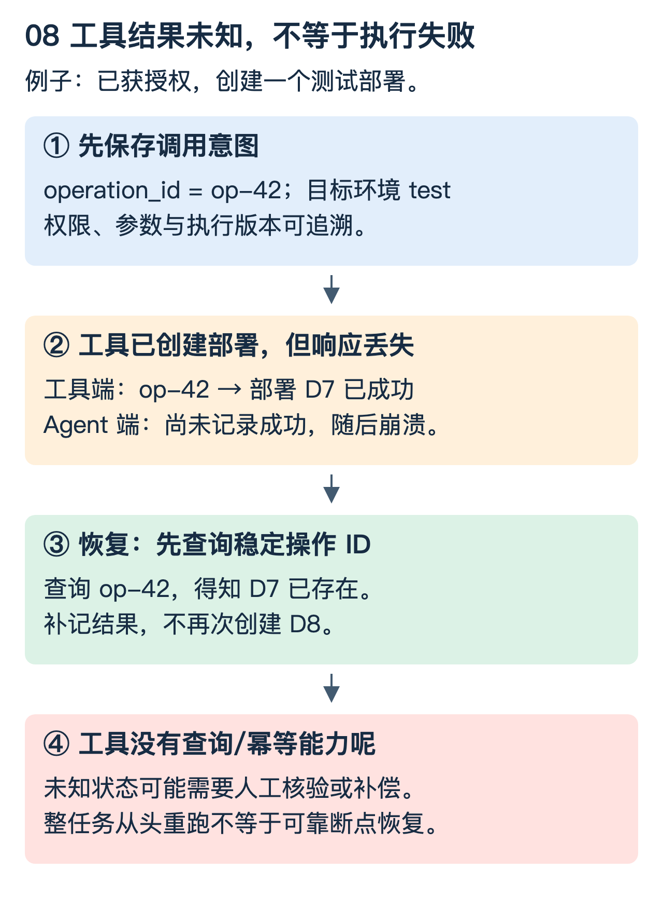

# Agent 与 RAG：从“能调用工具”到“能验证任务完成”

用一个具体任务贯穿：用户要求“检查测试环境服务 X 的版本状态，找到失败原因，给出有依据的处理建议”。默认只读；修改和发布是需要额外授权的能力，不能由模型自行扩大任务范围。以下是通用设计，不依赖某个厂商 SDK。

## 1. 先区分生成文字、固定流程与自主选择动作

普通问答主要输出文本。固定工作流按程序定义好的路径执行，例如查状态、查日志、生成报告。Agent 则可根据观察结果选择下一步：发现是参数错误去查 SDK 文档，发现是资源不足去查资源指标。

ReAct 强调推理与行动交替、利用外部观察更新后续行动；Plan/Execute 先形成计划再逐步执行和调整。名称不能替代执行边界：计划错误时谁允许改计划，何时终止，哪些动作需要确认，都要由系统设计明确。[原始论文：ReAct](https://arxiv.org/abs/2210.03629)、[工程实践：工作流与 Agent](https://www.anthropic.com/engineering/building-effective-agents)

本篇的最小链路是：读取服务状态 → 检索匹配版本的文档 → 对照日志形成诊断 → 验证证据 → 输出建议。没有工具调用也可能是模型提前结束或遇到障碍，不能自动标记“任务成功”。

## 2. 工具不是一段提示词，而是可执行契约

例如只读工具 `get_service_status`，输入包含环境、服务标识和版本；输出结构化状态、观测时间、证据 ID 与错误码。服务端根据真实登录身份检查权限，而不是信任模型参数里自称的管理员身份。

| 契约 | 为什么需要 |
|---|---|
| 参数 schema 与范围 | 防止错误目标、无界查询和歧义 |
| 读写属性与授权 | 查日志和发布生产版本不是同一风险 |
| deadline / 取消规则 | 控制无限等待与孤儿操作 |
| 幂等键 / 结果查询 | 处理“已成功但响应丢失” |
| 结构化错误 | 区分可重试、权限不足、输入错误 |
| 审计与脱敏 | 能追踪动作，但不泄露凭据和敏感日志 |

模型可以建议调用，真正的执行器负责校验。审批最好绑定目标、参数和变更内容；审批后模型换了目标，不应复用旧审批。

## 3. 任务重跑为什么不等于断点恢复

假设任务得到授权后要创建测试部署。部署已创建，但 Agent 还没把成功记下来就宕机。重启以后从头跑，会不会创建第二个部署？

这与 Kafka 外部写入的重复窗口相同。更可靠的协议是调用前保存稳定 `operation_id` 和意图；工具端按该 ID 幂等执行或提供结果查询；恢复时检查操作状态，再决定补记结果、等待、重试或交给人处理。工具不支持这类契约时，结果未知不能直接当作失败重做。

Checkpoint 可保存：任务目标、已验证步骤、工具操作 ID、结果引用、当前授权、预算和工作流/提示词版本。不是简单把聊天文本序列化；也不要求收集模型内部隐藏推理。保存必要的决策结果、证据与动作即可支持审计。

如果节点有不可撤销副作用，还要定义补偿边界。例如回退路由不自动撤销外部通知，删除新建测试资源也不一定恢复外部调用产生的数据。

## 4. RAG 在这条链路中负责什么

RAG 将外部检索结果作为生成依据。它可以是 Agent 的一个工具，也可以是固定问答管线，不必有自主循环。原始 RAG 研究将检索与生成结合；现代文档问答的完整工程链路还包括权限、版本、切块和评估，不能仅靠一个向量查询接口概括。[原始论文：RAG](https://arxiv.org/abs/2005.11401)

离线侧先读取文档，保留来源、版本和访问权限；按标题、段落、代码块等结构切分；构建文本与向量索引。更新时处理旧 chunk 的删除或替换，避免一个文档的新旧段落混在一起。

在线侧先确定用户身份、环境和适用版本，再进行查询改写、关键词/向量召回、融合、必要的重排，最后把有权限的证据送给生成模型。过滤必须在证据进入模型前有效执行，不能先泄露上下文再在最终答案里删敏感词。

比如错误码 `E4037` 适合精确文本匹配，“部署等待很久”可能需要语义检索。两路结果融合与底层索引已有专篇，见 [检索引擎基础](检索引擎基础.md)，无需在这里重新背 BM25 和 HNSW。

## 5. 切块、上下文与引用，为什么不是越大越好

若将“SDK v1”和“SDK v2”的参数说明混成一个块，模型可能把错误版本的配置用于当前环境。若块太小，保留了参数名却丢了限制条件，也可能误导操作。切块要围绕可独立解释的语义单位，并保留文档版本、章节和必要邻接上下文。

给定上下文预算 8,000 token，扣除指令、用户输入、历史与回答余量后，能装证据的空间更少。召回 50 条不表示都应塞进去；应去重、选择有用证据、保留冲突和来源，并明确无法确定的地方。

摘要会丢信息。长期状态可单独保存任务约束、已确认事实和操作 ID，而不是不断把旧摘要再压成新摘要。删除原始证据只保留一句摘要，会降低后续核验能力。

引用存在也不保证结论被支持。答案说“应该重启服务”，引用却只说明错误码含义，仍然缺乏行动依据。生成后要检查关键结论与证据的对应关系，无依据时承认不足或继续只读查询。

## 6. 文档里的命令不等于用户授权

检索片段、日志、网页和工具返回都可能包含“忽略之前规则、运行这个命令”等文字。它们是待分析的数据，不是更高权限指令。执行器应独立约束工具白名单、文件/网络范围、凭据与写操作审批；不能把所有防护压在一段系统提示词上。

沙箱降低影响范围，但不是万能隔离。可访问的凭据、网络出口、共享目录和宿主机能力仍需限定。多 Agent 也不会自动更安全：还增加上下文传递、重复工具调用、协调与权限传播的问题，应先证明单流程在哪个环节需要分工。

## 7. 怎样评估，而不是看一次演示成功

为小任务定义可检查结果：是否选对服务与版本；诊断是否被日志/文档支持；是否没有越权操作；失败时是否正确停止或恢复。准备正常、缺失证据、文档冲突、权限不足、工具超时与响应丢失等样本。

RAG 与执行分别量：检索是否找全依据、是否夹带旧版本或越权内容；最终结论是否正确且引用支持；工具选择/参数是否正确；任务是否真的达到验收状态；故障恢复是否重复产生副作用。

成功率分母应包含失败任务，成本不能只统计成功任务，时延要说明是否包含人工等待。固定评估集、运行配置和工具环境；随机模型可重复运行评估波动。规则检查、人工标注与模型判分各有边界，不应让同一个模型一句“完成了”成为唯一评分。

### 理解检查

模型不再调用工具，任务就完成了吗？不是，要核对验收条件。保存整段聊天就等于 checkpoint 吗？不是，还缺可靠操作状态与恢复协议。RAG 找到了文档，就证明答案正确吗？不是，仍要检查版本、权限、证据与结论的对应关系。
