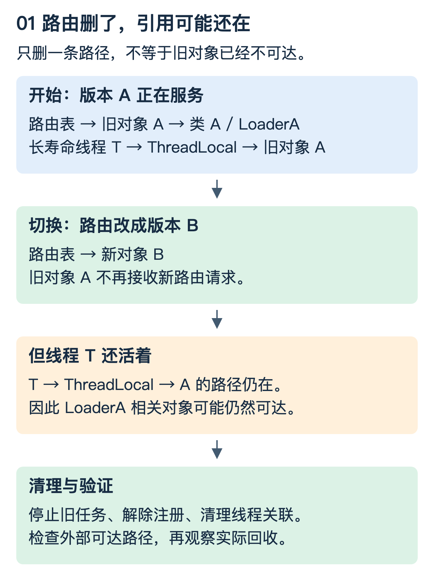

# JVM：类怎样进入进程，又为什么退不出去

这篇解决三个相连的问题：同名类怎样共存、切换版本为什么不等于卸载旧代码、内存增长该怎样定位。以 Java 21 的语言/API 规范为参照；Metaspace 指 HotSpot 实现，不能把它当成所有 JVM 的规范名称。

## 1. 先看两份同名的代码

设一个服务正在使用 `demo.Rule` 的版本 A，准备加载版本 B。两份字节码里的类名完全相同。能否放在一个 JVM 中？答案取决于谁定义它们。

把运行时类身份写成两列：

| 类的二进制名 | 定义它的加载器 | 身份 |
|---|---|---|
| demo.Rule | LoaderA | 类 A |
| demo.Rule | LoaderB | 类 B |

类 A 与类 B 不因名字相同而成为同一类型。A 的对象不能直接当成 B 使用；这正是“名字看上去一样，却类型转换失败”的一种来源。这里强调的是**定义加载器**，不一定是最初收到加载请求的加载器。[规范：运行时类身份](https://docs.oracle.com/javase/specs/jvms/se21/html/jvms-5.html#jvms-5.3)

实际调用需要一个双方认识的契约，例如 `api.RuleService`。由共享父加载器定义这个接口，LoaderA/B 分别加载实现，平台才能通过同一个接口调用两个实现。若各自连接口也复制了一份，它们实现的是两个不同身份的接口，边界就断了。

```text
共享层定义 api.RuleService
          ├── LoaderA 定义 impl.RuleA → 实现共享接口
          └── LoaderB 定义 impl.RuleB → 实现共享接口

路由表：version A → 对象 A；version B → 对象 B
```

这个设计隔离的是名称与依赖可见性。两个版本仍共享进程中的 CPU、堆等资源；一个版本无限分配对象，不能靠不同加载器避免影响另一个版本。

## 2. 加载、链接、初始化分别做什么

以下用一个没有常量特殊情况的类解释：

```java
class Counter {
    static int base = 7;
    static { base += 1; }
    int value = 3;
}
```

| 阶段 | 主要作用 | 本例应该怎样理解 |
|---|---|---|
| 加载 | 找到二进制表示并创建运行时类 | 不是执行所有字段赋值 |
| 验证 | 检查格式、类型与字节码约束 | 不等于验证业务逻辑正确 |
| 准备 | 为静态字段建立存储并给出初始默认值 | 普通静态 `base` 先是 0 |
| 解析 | 将符号引用解析到运行时实体 | 不宜简单理解为“全都换成物理内存地址” |
| 初始化 | 执行类初始化逻辑 `<clinit>` | `base` 先 7 后 8 |

验证、准备和解析归在链接中。解析可以延迟发生，不应背成“所有引用必须在初始化前解析完”。创建对象时执行的实例初始化 `<init>` 则是另一件事：`value=3` 不等于类初始化。常量变量的处理存在特殊规则，不能把普通 `static int` 的例子推广到所有 `static final`。[规范：链接与初始化](https://docs.oracle.com/javase/specs/jvms/se21/html/jvms-5.html#jvms-5.4)

预测一下：只获取某个类型的 `Class` 对象，一定执行它的静态代码块吗？不一定。要看操作是否触发初始化，例如 `Class.forName` 的相应重载允许指定是否初始化。应依据 API 与语言规则，不凭“拿到了类”猜测。[参考：Java 类初始化规则](https://docs.oracle.com/javase/specs/jls/se21/html/jls-12.html#jls-12.4)

## 3. 双亲委派不是“先自己找，失败再往上找”

标准 `ClassLoader.loadClass` 大意是：先检查是否已加载，再委派父加载器；父加载器无法加载时，才尝试自己的查找逻辑。自定义加载位置通常从 `findClass` 入手；重写整体委派策略需要理解重复定义、加载锁和类型约束。

现代 JDK 常见的内置层次是 Bootstrap、Platform、Application。不要把 Java 8 的 Extension ClassLoader 名称机械套到 Java 21。Bootstrap 的实现也不必表现为普通 Java 对象。[参考：Java 21 ClassLoader](https://docs.oracle.com/en/java/javase/21/docs/api/java.base/java/lang/ClassLoader.html)

“父优先”与“子优先”是依赖选择策略，不是安全等级排名。子优先可让插件优先使用自带库，但公共接口、JDK 类和跨边界对象仍需有清晰规则。依赖全部下沉共享层省内存，却加大版本耦合；全部打进插件增加独立性，也增加重复加载与维护成本。

## 4. 为什么移除路由以后，旧版本还在

现在只有三个对象：公共线程池中的线程 T、旧对象 A、旧加载器 LoaderA。平台把 `route[A]` 删除了。先预测：旧加载器是否马上可回收？



如果线程的 ThreadLocal 值仍指向 A，或者线程上下文加载器仍指向 LoaderA，旧版本就还有可达路径。公共层静态注册表、定时任务、监听器、驱动注册与未停止的线程也可能保留它。

类卸载要求满足相应可达性条件；“满足条件”又不等于立刻发生。请求 GC、关闭 URLClassLoader 或删除 jar 文件都不能单独保证卸载。关闭加载器主要释放它打开的资源，不是强制撤销所有已加载类。[规范：类卸载](https://docs.oracle.com/javase/specs/jls/se21/html/jls-12.html#jls-12.7)

常见误解是“旧类有静态变量，所以永远不能卸载”。如果整组类、对象和加载器都不再被外部活对象关联，内部相互引用本身并不自动构成永久存活理由。真正要找的是通往 GC Roots 的路径。

## 5. 堆、Metaspace、进程内存不能混看

| 观察到的现象 | 需要检验的假设 | 可收集的证据 |
|---|---|---|
| 发布越多，加载类数越多 | 旧加载器未释放、正常保留版本增加 | 加载/卸载计数，存活加载器及版本数量 |
| GC 后堆仍持续增加 | 缓存无界、队列积压、对象被保留 | 堆直方图、引用链、稳定负载对比 |
| 堆平稳但进程 RSS 上升 | 元数据、线程栈、直接内存等增长 | 线程数、原生内存统计、容器内存指标 |
| 容器被 OOM kill | 总内存超过约束，不一定是 Java 堆 OOM | 容器事件、内存限制、退出原因 |

排查顺序应是确认时间线与最近变更，区分内存区域，再找增长主体及保留路径。不要一看到 RSS 大就扩大 `-Xmx`，那甚至可能挤压其他内存区域。

有 JDK 工具且拥有目标进程权限时，可以从 `jcmd <pid> help` 查看该版本支持的诊断命令，再选择类加载器、线程和内存统计。堆 dump 可能暂停应用、占用磁盘并包含敏感数据，应先评估影响；不要把生产 dump 当成普通可公开附件。

## 6. 怎样证明治理有效

固定请求负载，反复加载相同规模的新版本，每次按完整生命周期停止旧任务、解除注册、清理 ThreadLocal 和外部引用。在相近的回收条件下比较稳态，而不是拿刚启动和发布十次后的瞬时值比较。

需要同时看旧版本数量、活加载器数、类元数据占用和请求错误。如果内存下降只是因为进程重启，证明的是恢复能力，不是泄漏根因已经消除。

### 理解检查

1. 两个加载器各加载一份 `api.RuleService`，为什么名字一致也可能不能转换？因为运行时类型身份不同；共享接口应由共同加载层定义。
2. Loader 隔离能否保证业务 A 的死循环不影响 B？不能，仍共享进程资源。
3. 删掉路由但线程池里还有旧监听器，接下来应该查什么？从存活线程/注册表到旧实例和加载器的引用链。

下一篇：[Java 集合、并发与缓存](Java_集合并发与缓存正确性.md)。
