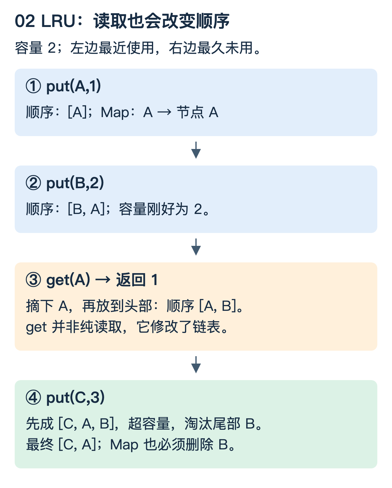

# Java：从一个 HashMap 到线程安全缓存

这篇围绕一件事展开：既要快速找对象，又要让多个线程共同维护正确状态。HashMap 的具体拆桶例子参照 OpenJDK 8；并发 API 语义参照 Java 21，避免混用不同版本实现。

## 1. 桶下标是怎样算出来的

想象八个抽屉，编号 0—7。已经经过扰动的哈希值为 3、11、19，它们与 `7` 做按位与，结果都为 3，因此进入同一个桶。哈希值不等于 key 身份；落桶后还要比较 key。

```text
容量 8：mask = 0111
  3 = 00011 → 桶 3
 11 = 01011 → 桶 3
 19 = 10011 → 桶 3

容量 16：mask = 01111
  3 → 桶 3
 11 → 桶 11
 19 → 桶 3
```

扩成两倍后，只多看原容量代表的那一位。原桶中的节点要么留在原位置，要么移动到“原位置 + 原容量”。OpenJDK 8 的链表拆分据此划分高低两组，并使用已保存的哈希值；不是普通 HashMap 在扩容期间自动执行“两个数组双查”的并发迁移协议。[源码：HashMap.resize](https://github.com/openjdk/jdk8u/blob/master/jdk/src/share/classes/java/util/HashMap.java)

0.75 是常见默认负载因子，表达元素数量相对容量的扩容阈值，不是“某个桶用到了 75%”。冲突桶树化还受容量等条件影响；不能说“只要到八个就无条件变红黑树”。平均常数时间依赖哈希分布与负载，不是所有输入都同样快。

## 2. ConcurrentHashMap 为什么还不够

两个线程都想完成“如果 key 不存在，就创建一个对象”：

```text
T1: containsKey(k) → false
T2: containsKey(k) → false
T1: create() → 对象 A
T2: create() → 对象 B
T1/T2: 各自 put
```

即使用并发 Map，独立方法安全也不表示方法组合原子。`putIfAbsent`、`computeIfAbsent` 等 API 可以表达某些原子更新，但回调应短小，不能随意在锁相关路径执行长时间远程调用；异常、删除与再次计算等条件也要考虑。[参考：ConcurrentHashMap](https://docs.oracle.com/en/java/javase/21/docs/api/java.base/java/util/concurrent/ConcurrentHashMap.html)

多字段不变量更明显：缓存同时有 Map、双向链表、大小计数。只把 Map 换成并发 Map，不能阻止链表指针与 Map 成员不一致。要么用一致的锁保护整个操作，要么设计并证明更复杂的并发协议。

## 3. 用三次访问理解 LRU

缓存容量为 2，链表左边为最近使用，右边为最久未使用。依次执行 `put(A)`、`put(B)`、`get(A)`、`put(C)`。先预测最后淘汰谁。



答案是 B。虽然 `get(A)` 看起来是读取，它改变了访问顺序。因此精确 LRU 的 get 也是修改操作，不能简单给它套一个共享读锁。

Map 存 `key → Node`，可以快速找到节点；双向链表支持快速摘除和插到头部。二者分别解决定位和顺序问题。只用普通链表，按 key 找节点就需要遍历；只用 Map，又没有最久未使用顺序。

教学实现用一把锁覆盖 `get/put` 中的全部不变量，平均 O(1) 操作不包含锁等待时间。容量为 0 时不存储，更新已有 key 不增加大小；过期时间、按字节容量、加载合并都属于额外能力。生产缓存还可能使用近似策略，不能把“用了某个缓存库”说成必然是精确 LRU。

运行 [基础算法实验](examples/foundation_algorithms.py)，其中 `LockedLRU` 用显式节点和锁演示相同顺序，检查更新、淘汰和容量为 0。该实验用 Python 表达不变量，不实现 Java 内存模型，也不是并发压测。

## 4. 可见性、原子性和互斥不是一个概念

`count++` 可以拆成读、加一、写回。两个线程都读到 0，再各自写 1，最终不是 2。即使字段使用 volatile，也不能把这个复合操作变成原子递增。

Java volatile 用于相关可见性与顺序约束；互斥锁可以保护一段临界区。原子变量的 CAS 则是“仅当当前值仍等于预期值时更新”，失败后重新读取并重试。选择取决于不变量：一个计数可以原子递增，涉及两个账户或 Map+链表就不能靠一个独立计数器解决。[规范：Java 内存模型](https://docs.oracle.com/javase/specs/jls/se21/html/jls-17.html#jls-17.4.5)

“线程安全”也应明确作用范围：单个实例的方法是否安全、多个对象组合是否安全、是否要求线性一致的快照。一个组件线程安全，不代表由它拼出的所有业务操作线程安全。

## 5. ThreadLocal 为什么会串请求或留住对象

ThreadLocal 是线程关联的变量槽，不是加载类的工具。在线程池里，请求 A 用完线程 T，下一次请求 B 可能复用 T。如果 A 留下了租户信息而没有清理，B 可能读到上一个请求的上下文。

```java
tenantContext.set(tenant);
try {
    handleRequest();
} finally {
    tenantContext.remove();
}
```

异步任务可能换线程，不能假设上下文天然跟过去。应明确捕获哪些可信字段、何时传播与清理，避免把整个请求对象或大缓冲长期挂在线程上。弱引用 key 不等于 value 在所有场景下立即释放。[参考：ThreadLocal API](https://docs.oracle.com/en/java/javase/21/docs/api/java.base/java/lang/ThreadLocal.html)

## 6. 线程池为什么“加线程”不一定快

有 4 个工作线程，每个任务占用线程约 100ms，忽略其他瓶颈时理论处理能力约 40 个/秒。若每秒持续到来 60 个，队列每秒约增加 20 个；无界队列只是把拒绝延迟到内存耗尽。

ThreadPoolExecutor 的常见工作关系是先补核心线程，再尝试入队；队列无法接收时再考虑非核心线程直到上限，最终触发拒绝策略。因此无界队列下，把最大线程数调很大未必生效。[参考：ThreadPoolExecutor](https://docs.oracle.com/en/java/javase/21/docs/api/java.base/java/util/concurrent/ThreadPoolExecutor.html)

必须共同设计线程数、队列容量、超时、拒绝和下游并发。CallerRuns 可以把压力传回提交线程，但在事件循环或关键控制线程上执行耗时任务可能导致更大阻塞。不要只背策略名称，要确认由谁承担等待或丢弃。

### 理解检查

1. get(A) 为何要加锁？它改变双向链表，不只是查询 Map。
2. 桶 3 从容量 8 扩到 16，原来的节点会随意散到所有桶吗？不会；本例只可能到 3 或 11。
3. 每秒来 60 个、只能完成 40 个，队列能解决持续过载吗？不能，只能暂存有限突发。

进一步练习：[算法中的状态与不变量](算法_从状态推导LRU与最大子数组.md)。
