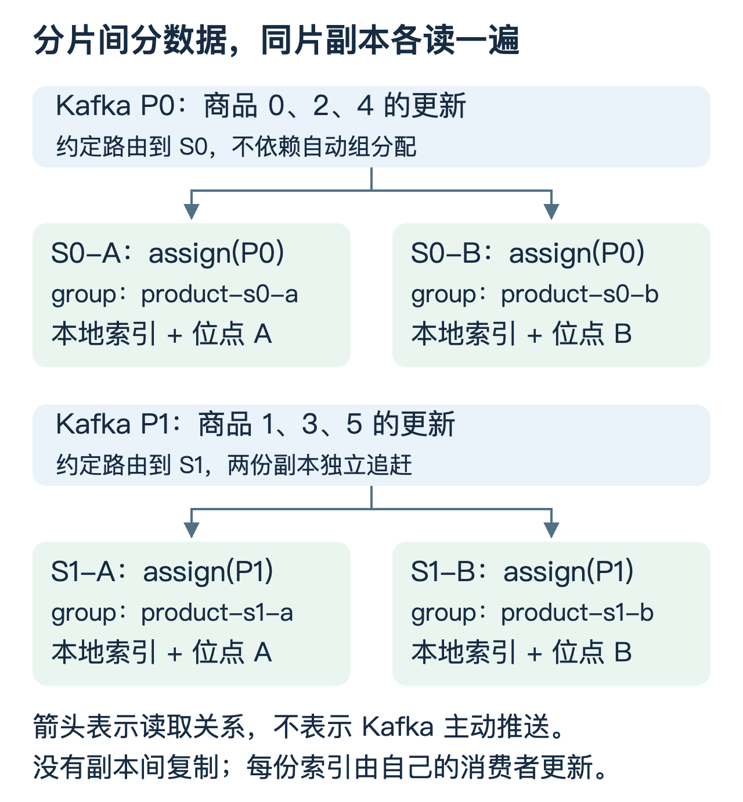

# Kafka：分片副本独立消费与 Java 实现

这篇回答一个具体问题：**索引已分片、每片又有多个副本，如何指定读取 Kafka 分区，并让同一分片的所有副本各自更新本地索引？**

先给结论：手动 `assign()` 相同的分区集合，各副本使用独立、稳定的 `group.id`，从与各自本地索引匹配的检查点恢复。`assign()` 负责“读哪里”，不会替引擎完成索引复制、故障接管或数据校验。

本文是通用教学设计，Java 示例以 `kafka-clients 4.1.0` 为编译基线，使用普通 `KafkaConsumer`，不讨论 Share Groups。代码是接入骨架，不包含真实索引存储实现。

## 1. 分片拆数据，副本复制同一片数据

有六个商品，教学规则是 `商品 ID % 2`：S0 存 0、2、4，S1 存 1、3、5。每片存两份：S0-A / S0-B，以及 S1-A / S1-B。

S0 和 S1 内容不同，合起来才是全量数据。S0-A 和 S0-B 的目标内容相同，但消费进度可能暂时不同。它们都独立从 Kafka 更新时，不必存在负责向另一份发送更新的主副本。

分片、副本是数据组织方式，节点是承载它们的进程或机器。一个节点可以承载多个分片副本；不要把“分片节点”和“副本节点”当成两种互斥的服务器。Kafka 自己的日志副本又是另一层，不能代替引擎索引副本。

假设生产端还明确保证：Kafka P0 存 S0 的更新，P1 存 S1 的更新。这个映射是本例的设计约定，不是 Kafka 自动知道了引擎路由。



| 引擎分片 | 副本 | 指定 Kafka 分区 | 独立 group.id |
|---|---|---|---|
| S0：0、2、4 | A | product-change / P0 | product-s0-a |
| S0：0、2、4 | B | product-change / P0 | product-s0-b |
| S1：1、3、5 | A | product-change / P1 | product-s1-a |
| S1：1、3、5 | B | product-change / P1 | product-s1-b |

商品 2 改价时，消息进 P0，S0-A 和 S0-B 各读一次、各写一次。S1 的两份副本无需处理这次改价。查询全部商品时，通常从 S0 选一个可用副本、从 S1 选一个可用副本，再合并结果；不是把四份都查一遍。

如果一个引擎分片对应多个 Kafka 分区，同片所有副本就指定同一组分区。若 Kafka 分区混合多个引擎分片的数据，则要增加路由层，或明确定义读取后过滤；不能只改消费者分区编号就假定数据完整。

## 2. “广播”与自动分配、手动分配的边界

Kafka 的广播通常指多个独立订阅方读取同一日志，不是生产者调用某个广播开关，也不需要为每个消费组另存一份业务日志。

| 使用方式 | 分区归属 | 同片两份副本怎样收到同样的更新 |
|---|---|---|
| `subscribe()`，同一个组 | 组内自动分配，正常情况下一个分区分给一个成员 | 不能指望两成员各自获得全部更新 |
| `subscribe()`，不同组 | 各组独立分配和消费 | 可以独立读取，但需解决分配结果与本地索引分片的对应关系 |
| `assign()`，明确指定分区 | 不参与自动组分配 | 多个消费者指定同一分区即可独立读取；进度必须隔离 |

本例选择第三种。不同 `group.id` 主要用于隔离 Kafka 上保存的位点，不是让 `assign()` 生效的前提。即便 group 相同，手动分配也可以读同一分区，但提交同一组、同一分区的 offset 会相互覆盖，因此不要这样管理独立副本。

这里没有自动组成员心跳、加入退出所触发的重平衡流程；它仍需要 Kafka 网络通信，并在使用 Kafka 位点存储时与 Coordinator 交互。不能把 `subscribe()` 的成员接管机制照搬过来。`assign()` 与 `subscribe()` 也不能混用。[依据：KafkaConsumer 的 Manual Partition Assignment](https://kafka.apache.org/41/javadoc/org/apache/kafka/clients/consumer/KafkaConsumer.html)

## 3. 只问 group 数量：1,000 个会不会有压力？

只看管理规模，1,000 个稳定的小组通常不是需要直接否定方案的数量级。这是有前提的工程判断，不是 Kafka 官方给出的容量承诺，也不表示任何规格都能无压力运行。托管平台可能另有组数配额。

本例手动 `assign()` 没有自动成员重平衡开销，仍有组/位点元数据、提交请求和恢复读取等管理成本。相同的 1,000 个组，如果每组保存的分区位点数量不同，其状态量也不同；不能给每个组拍一个固定内存占用。

还要区分三个数字：

- `group.max.size` 是 Classic 协议下单组成员数量上限，不是集群组数上限；Consumer 协议对应 `group.consumer.max.size`。
- `__consumer_offsets` 的分区数不是可创建组数，一个内部日志分区可以承载许多组的元数据。
- 活跃且稳定、长期不活跃、频繁更换身份的组，其管理负载不同。副本重启应保留稳定逻辑身份，不要每次生成新 UUID 当 group.id。

组协调与位点管理会分布到负责不同内部位点分区的 Broker。[参考：Kafka 4.1 Broker 配置](https://kafka.apache.org/41/configuration/broker-configs/)、[Confluent 消费者协调说明](https://docs.confluent.io/platform/current/clients/consumer.html)

## 4. 消费代码：相同 assign，不同 group，不同本地索引

完整代码：[ShardReplicaConsumer.java](examples/kafka-independent/ShardReplicaConsumer.java)。它可编译，但必须接入符合契约的 `LocalIndex` 才能作为真实引擎消费者运行。

### 4.1 两个副本分别启动

下面是两个不同进程中的调用片段，不要顺序放进同一个主线程等待第一个无限循环返回。`localIndexA/B` 是待实现的本地索引适配器，`running` 是进程生命周期使用的 `AtomicBoolean`。

```java
// S0-A 进程
ShardReplicaConsumer.run(
    "kafka:9092", "product-s0-a",
    List.of(new TopicPartition("product-change", 0)),
    localIndexA, running::get
);

// S0-B 进程：分区相同，group 和本地索引不同
ShardReplicaConsumer.run(
    "kafka:9092", "product-s0-b",
    List.of(new TopicPartition("product-change", 0)),
    localIndexB, running::get
);
```

S1 的两份副本分别使用 `product-s1-a`、`product-s1-b`，并将 partition 改为 1。若 S0 对应 P0、P2，两份 S0 副本都传入 `List.of(new TopicPartition("product-change", 0), new TopicPartition("product-change", 2))`。给 `assign()` 的是完整集合，不是每次增量追加一个分区。

生产端必须遵守相同路由。例如在本教学约定下，商品 2 发到 P0 可以显式指定：

```java
producer.send(new ProducerRecord<String, String>(
    "product-change", 0, "2", eventJson
)).get(); // 教学示例：等待确认；不等于保证数据库与 Kafka 原子提交
```

只设置 key 为 `"2"`，不能据此断言默认分区器一定选择 P0。真实系统应统一路由规则及其版本，扩分区、迁移分片时另做协议设计。

### 4.2 核心循环逐步看

下面摘自完整 Java 文件。上下文中 `consumer` 为 `Consumer<String, String>`，`index` 为索引适配器，`partitions` 为配置好的列表。

```java
// 恢复索引后取得相匹配的“下次读取位置”，不是直接信任 Kafka 最新提交。
Map<TopicPartition, OffsetAndMetadata> recovered = index.recoverNextOffsets();
consumer.assign(partitions);
for (TopicPartition tp : partitions) {
    consumer.seek(tp, recovered.get(tp));
}

while (running.getAsBoolean()) {
    ConsumerRecords<String, String> records = consumer.poll(Duration.ofSeconds(1));
    if (records.isEmpty()) continue;

    // Kafka 4.1 的 nextOffsets 保留下一读取位置及可用的 leader epoch。
    Map<TopicPartition, OffsetAndMetadata> next = Map.copyOf(records.nextOffsets());
    index.applyAndCheckpoint(records, next);
    consumer.commitSync(next);
}
```

完整代码会先校验分区列表和检查点。处理顺序是：指定读取范围 → 恢复各分区起点 → 拉取一批 → 应用全部消息并建立可靠检查点 → 记录 Kafka 位点。每个副本都独立执行这套流程。

`nextOffsets()` 是该次 poll 后的读取位置，只有本批全部按契约应用成功才能提交。它也能处理日志中的 offset 间隙；offset 差值并不总等于业务消息条数。本例空批直接跳过，因此不主动提交只有控制记录等原因造成的空批位置推进，可能导致进度监控偏保守，但不会跳过未应用数据。

### 4.3 配置的目的

| 配置 | 本例取值 | 意义 |
|---|---|---|
| enable.auto.commit | false | 自己控制提交，不能拉到消息就认定索引已可靠写入 |
| auto.offset.reset | none | 缺失或越界时失败，不静默跳到最新位置 |
| isolation.level | read_committed | 有事务消息时不读取未提交/已中止事务；不让外部索引自动具备事务性 |
| max.poll.records | 500 | 教学批量值，不是生产调优结论 |
| group.id | 稳定的逻辑副本身份 | Kafka 位点存储隔离；不是每次启动随机生成 |

示例未配置 TLS/SASL，应按实际集群补齐。`KafkaConsumer` 不允许普通 API 被多线程随意并发调用。本例停止标志在批次边界生效，不能保证立即退出；生产代码需要明确超时、关闭和必要的 `wakeup()` 异常处理策略。

## 5. 最难的不是 assign，而是索引与检查点匹配

`LocalIndex` 需要实现两个方法：

```java
Map<TopicPartition, OffsetAndMetadata> recoverNextOffsets();

void applyAndCheckpoint(
    ConsumerRecords<String, String> records,
    Map<TopicPartition, OffsetAndMetadata> nextOffsets);
```

第二个方法不能简单实现成“更新内存索引，再把 offset 写到另一份文件”。如果 offset 文件先持久化，而索引还未持久化，崩溃就会留下领先的检查点，恢复时跳过缺失数据。

契约是：同分区按顺序应用；更新支持幂等重放；建立可恢复的索引与检查点对应关系；本批未涉及的分区检查点必须保留；出错抛异常，不能跳过后继续提交。可以用索引引擎的原子提交元数据、可靠 WAL 等实现，但需要引擎自己的协议与故障测试，不是增加一个 Java 接口就完成了。

举例，Kafka P0 的 offset 100 表示“商品 2 设为价格 80，版本 9”：

| 副本 | 恢复索引包含的更新 | 与之匹配的 next offset |
|---|---|---|
| S0-A | 已安全应用到 100 | 101 |
| S0-B | 已安全应用到 98 | 99 |

B 恢复时必须从自己的 99 继续，不能借用 A 的 101。Kafka 提交位点在本例中是进度记录；恢复权威是本地索引对应的检查点，所以即使 Kafka 中记录为 101、本地只能恢复到 next=99，也从 99 重放。

| 故障位置 | 本例怎样恢复 |
|---|---|
| 写索引前失败 | 不提交，从原检查点重新读 |
| 索引部分生效、检查点尚未完成 | 恢复可验证的旧检查点，允许重放；写入必须幂等 |
| 索引与检查点已完成，Kafka commit 失败 | 退出并从本地检查点恢复，不要求倒退到 Kafka 旧位置 |
| 本地数据丢失，只剩 Kafka 最新位点 | 不能直接续读；先加载快照和匹配的增量边界 |
| 检查点需要的日志已清理 | 失败告警，取得可衔接的新快照或重建 |

每个商品的版本判断必须与更新受同一原子边界保护：新版本应用，同版本同内容可忽略，旧版本拒绝；同版本异内容应告警。删除也需要保留能挡住旧更新的版本信息。详见主文第 6 节。

快照的恢复身份至少要绑定目标索引代次、来源集群/topic 身份、分区映射版本和每分区检查点。不要把旧 topic 删除重建后的同名分区、或另一代索引，误当成同一条历史。以上身份校验属于索引适配层与控制面，示例接口没有替你实现。

[依据：KafkaConsumer 的 Storing Offsets Outside Kafka](https://kafka.apache.org/41/javadoc/org/apache/kafka/clients/consumer/KafkaConsumer.html) 明确描述了将搜索索引及位点放在同一可恢复边界的用法。

## 6. 副本故障后，谁接流量、谁恢复？

A、B 独立消费，A 挂掉不会使 B 获得新分区；B 原本就读取同一分区，继续即可。平台应摘掉 A 的查询流量，确认 B 的索引代次、覆盖范围、可见进度和容量满足要求后由它提供服务。

恢复 A 的顺序：加载本地索引或快照 → 取匹配检查点 → 追赶增量 → 校验索引与查询可见性 → 达到约定新鲜度门槛 → 重新接流量。追赶不是只看“进程在线”，Kafka lag 也不等于查询可见进度。

同片副本最终收敛需要相同基线、完整更新流、兼容的处理逻辑和正确的版本规则。异步独立消费本身不承诺读到完全相同的瞬时状态。

还要防止一个逻辑副本启动两个进程。`assign()` 不提供自动组成员排他，控制面需要租约/实例所有权及必要的下游 fencing；如果同一副本身份下两个进程分别维护不同磁盘状态，又互相覆盖 Kafka 位点，会使运维和恢复判断失真。

## 7. 运行 Java 自测

需要 JDK 17+、Maven；首次运行会下载依赖。源码、测试和 Maven 配置均在 [examples/kafka-independent](examples/kafka-independent)。在工程根目录运行：

```bash
mvn -q -f examples/kafka-independent/pom.xml compile exec:java
```

[测试代码](examples/kafka-independent/ShardReplicaConsumerTest.java) 使用 Kafka 的 `MockConsumer`，不需要启动 Kafka，也不会连接业务服务。它检查两份模拟副本分别处理相同记录、固定分区、从本地检查点 seek、成功提交下一位置、写入失败不提交、缺失检查点拒绝启动，以及 Kafka 位点不能覆盖较旧的本地恢复点。

测试索引只是内存实现，验证的是消费 API 调用和错误分支，**没有验证真实 Broker 上的组隔离、磁盘持久化、索引原子提交、租约或网络故障**。真实接入前仍要进行断电恢复、提交响应丢失、过期位点、新副本重建和双实例冲突测试。

验证记录（2026-09-28）：使用 JDK 21 的 `javac --release 17`、Kafka clients 4.1.0 编译通过，以上 MockConsumer 自测通过。当前环境 Maven Central 下载超时，因此未完成上述 Maven 一键命令的端到端验证；实际编译与运行使用单独下载的依赖完成，未修改全局 Maven 配置。

## 8. 理解检查

1. 两份 S0 副本都 `assign(P0)`，是不是 Kafka 会只让其中一份消费？
2. `group.id` 相同但调用 `assign()`，是否自动触发 Rebalance？为什么仍不建议共用位点？
3. Kafka 记录 next=101，本地索引只能恢复到 next=99，本例从哪里读？
4. 全新空磁盘副本有没有资格直接从旧副本最新提交位点继续？
5. `applyAndCheckpoint()` 抛异常，能否捕获后继续下一轮 poll？

答案：1. 不会，手动分配允许独立读取；2. 不自动重平衡，但同组同分区提交会互相覆盖；3. 从与索引匹配的 99 重放；4. 没有，先获得全量基线和增量边界；5. 本例不能这么做，否则可能跳过失败批次，必须先停下并恢复/重试到正确位置。

知识链：**业务路由 → Kafka 分区 → 各副本手动分配 → 各自索引与检查点 → 幂等恢复 → 查询流量准入**。回到 [Kafka 数据链路与高可用](Kafka到检索引擎_数据链路与高可用.md) 继续阅读全量增量衔接、Kafka ISR 和端到端故障恢复。
