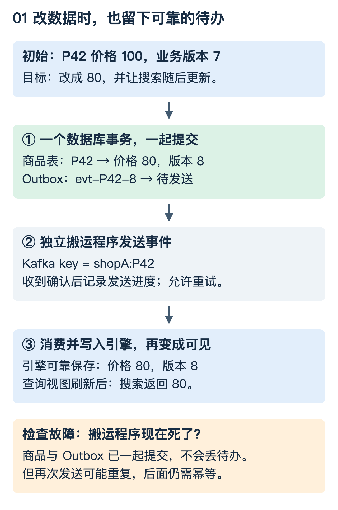
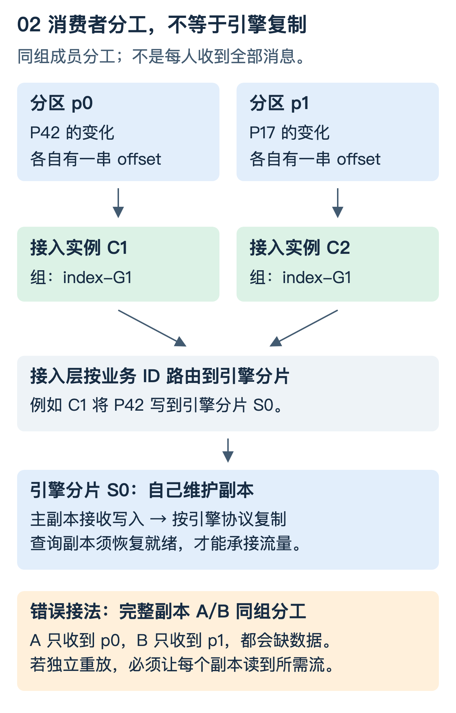
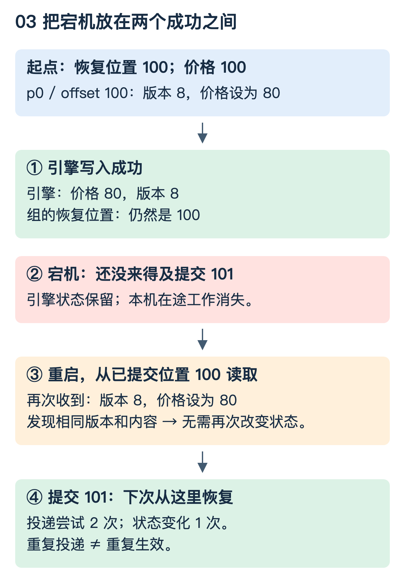
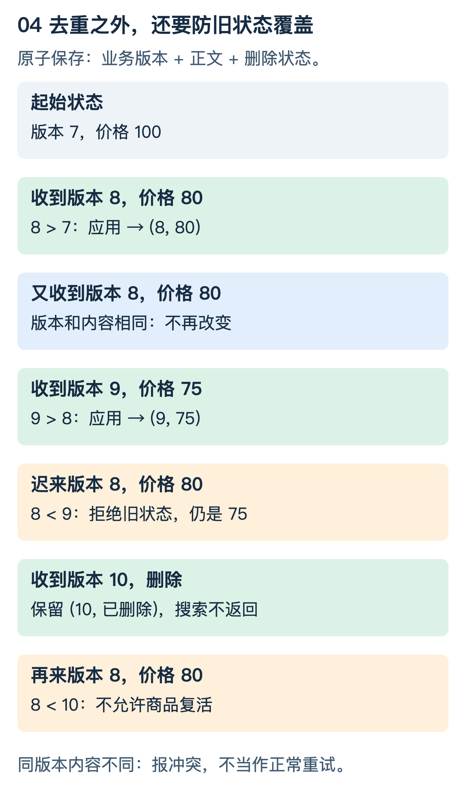
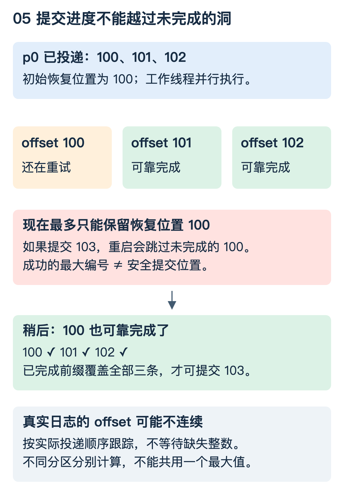
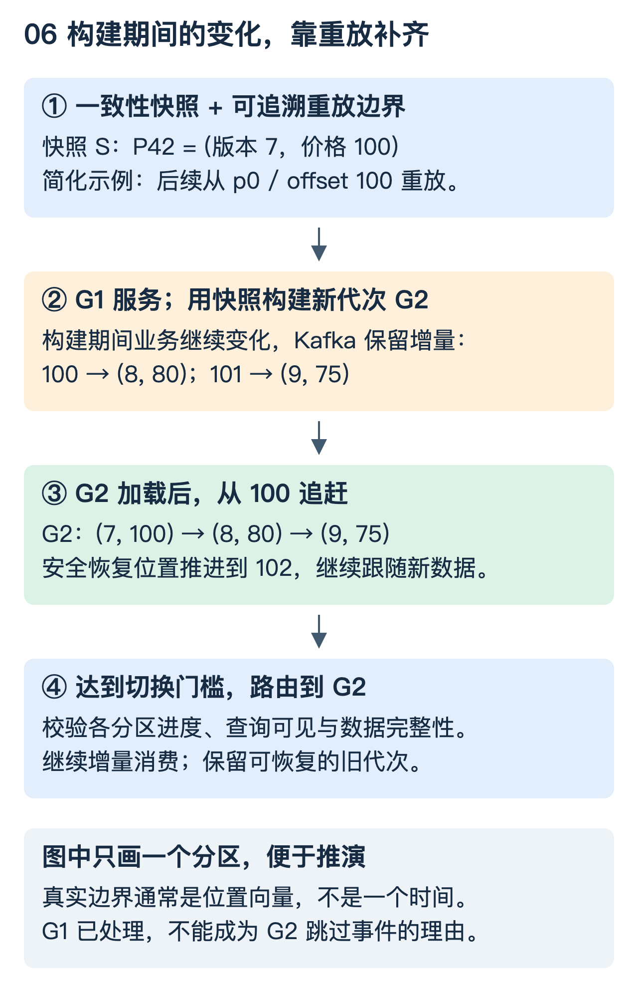
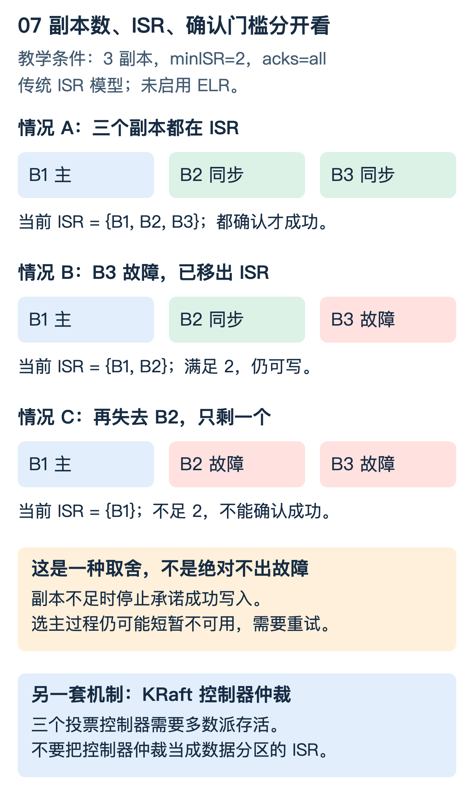

# Kafka 到检索引擎：数据怎样进来，故障后怎样接着走

前面的索引图解回答“文档进入引擎以后怎样存、怎样查”。这一篇往前走一步：业务改了一条数据，怎样可靠地变成搜索结果？

先记住主线：**业务可靠地产生变更 → Kafka 保留可重放的日志 → 消费端可靠地写入引擎 → 引擎让新数据对查询可见。** 每一段都有自己的成功条件，不能拿其中一个成功代替全链路成功。

本文以 Kafka 4.1 的普通消费者组 API 为配置参照，不讨论 Share Groups。复制示例采用传统 ISR 模型，未启用 ELR；实际部署需核对版本、功能开关和引擎的写入契约。示例是教学设计，不代表某个现有系统的实现。

## 阅读地图

| 想弄明白什么 | 阅读位置 |
|---|---|
| 业务怎么发消息，改数据库后发送失败怎么办 | 第 1—3 节 |
| 引擎怎么消费，分区与引擎副本怎么配合 | 第 4 节 |
| 重复、乱序、删除回流怎么处理 | 第 5—7 节 |
| 并发消费、部分失败、消费者切换怎么处理 | 第 8—9 节 |
| 全量索引怎样接上增量 | 第 10 节 |
| Kafka 与引擎怎样分别保证高可用 | 第 11—12 节 |
| 亲手复现重复与丢失 | 第 13 节 |

## 1. 从一次改价开始，不先背术语

商品 `P42` 当前价格 100 元，版本号为 7。商家把价格改成 80 元，新版本号为 8。这里的版本号由业务数据源为同一商品单调递增地分配，不是客户端时间戳。

希望发生四件事：数据库里变成 80 元；这次变化有记录；引擎收到后更新文档；搜索终于能看到 80 元。

先问一个问题：数据库更新成功，消息发送之前进程就死了，搜索会变成多少？如果没有补偿机制，它可能一直保持 100 元。



图中多出来的“待发送事件表”，相当于商家改价时同时留一张发货单：业务数据和发货单在**同一个数据库事务**中提交。之后由独立搬运程序把发货单送到 Kafka。搬运程序死了，发货单还在，可以继续送。这种做法叫事务发件箱，通常称为 Outbox。

这没有让数据库和 Kafka 变成一个大事务。它把难以保证的“必须同时写两个系统”，改成“先可靠地记下需要发送的事实，再允许重复地发送”。重复的问题留给后面的幂等机制解决。Debezium 的 Outbox 路由器使用事件 ID 和聚合对象 ID 来承载事件身份与分区键。[参考：Debezium Outbox](https://debezium.io/documentation/reference/stable/transformations/outbox-event-router.html)

## 2. 一条消息至少要把什么说清楚

本篇用完整状态消息，而不是“价格减 20”这样的增量指令：

```json
{
  "schema_version": 1,
  "event_id": "evt-P42-8",
  "entity_id": "shopA:P42",
  "entity_version": 8,
  "op": "UPSERT",
  "payload": {"name": "白色运动鞋", "price": 80, "status": "ON_SALE"}
}
```

`evt-P42-8` 是便于阅读的教学编号；真实事件 ID 要满足系统要求的唯一性。同一事件重试时保持 ID 不变，不要每重试一次就重新生成。多租户场景将租户身份纳入主键，并由可信链路校验。

| 名字 | 回答的问题 | 例子与限制 |
|---|---|---|
| entity_id / Kafka key | 改的是谁 | `shopA:P42`；用于路由和文档身份 |
| event_id | 是不是同一次业务事件 | 同一次发送重试仍是 `evt-P42-8` |
| entity_version | 对这个商品而言谁更新 | 8 新于 7；不同商品的版本不可比较 |
| topic + partition + offset | 这条消息在 Kafka 哪里 | `products / p0 / 100`；offset 不是全局序号 |
| index_generation | 正在写哪一代索引 | `G1` 或重建中的 `G2`；属于目标写入上下文 |
| schema_version | 怎样解释消息字段 | 不能和商品版本号混用 |

Kafka 的 offset 由日志系统分配。业务不能拿两个分区的 offset 比较全局先后；也不能拿 offset 直接当任意来源数据的业务版本。引擎内部的 Segment docID 更是另一种编号，会随着索引组织变化，不适合当业务主键。

还有一个经常忽略的问题：一次修改要关联商品、库存和类目三张表，谁负责拼成完整搜索文档？可以由业务产生完整事件，也可以由有状态处理层维护关联结果。直接在消费时“查一下最新数据库”会改变事件的时间语义：重放同一事件，可能拿到不同内容。选择这种方式，就应明确目标是“刷新到当前状态”，而不是精确重现历史状态，并处理数据库不可用和读副本延迟。

## 3. 业务如何把数据发进 Kafka

### 3.1 三种入口，不要混成一种

| 入口方式 | 适合的前提 | 需要额外解决什么 |
|---|---|---|
| 业务直接发 Kafka | 日志就是主要事实来源，或数据本身不要求和数据库原子提交 | 明确“业务成功”以什么 ACK 为准，失败如何重试 |
| 数据库业务表 → CDC → Kafka | 需要同步已提交的数据库变化 | 快照、日志位点、DDL、权限和关联数据语义 |
| 业务表 + Outbox → 搬运 / CDC → Kafka | 希望消息表达明确的业务事件 | 事件表清理、发送进度、积压与重复 |

CDC 是从数据库变更日志捕获已提交变化，不是每隔几秒对全表做一次差异扫描。数据库切主后日志能否连续读取、日志保留是否足够，都直接影响这条链路。

下面是 Outbox 的逻辑伪代码；行锁、版本分配、事务隔离级别应结合实际数据库实现：

```text
begin database transaction
  锁定并读取 P42：price=100, version=7
  更新 P42：price=80, version=8
  插入 outbox：event_id=evt-P42-8, 完整状态, version=8
commit database transaction

搬运程序读到 outbox
  send(topic="products", key="shopA:P42", value=event)
  等待发送结果
  成功后记录发送进度；失败或结果不确定则保留并重试
```

搬运程序不能在调用异步 `send` 后立即标记“已发送”。即使等到了成功，也可能在保存发送进度前崩溃，重启后再次发送。因此消费者仍然要能处理重复。数据库事务、Kafka 发布和发送进度分别在哪个持久化边界内，必须逐个说明。

### 3.2 key 保证什么，不保证什么

固定分区策略和分区数时，把同一商品 ID 用作 key，可以将它的变化路由到同一分区。分区内有日志顺序，但并不自动等于业务版本顺序：多个发送者竞争、搬运程序并发，以及下游并行处理都可能打乱业务先后。

例如两个搬运线程先送 version 9，再送 version 8，Kafka 会忠实记录这个到达顺序；不会替你理解 9 比 8 新。所以业务版本校验仍然有价值。增加分区数也可能改变 key 的路由，不能一边扩分区，一边默认历史和新消息仍在同一条有序队列里；需要迁移、屏障或能容忍乱序的下游协议。

### 3.3 生产者幂等不是业务去重

一个生产者发送后没收到响应，它不知道是“服务端没收到”，还是“收到了但响应丢了”。启用 `enable.idempotence=true`，可防止生产者协议层重试在日志里写出重复副本；Kafka 4.1 要求配合 `acks=all`、允许重试以及不超过 5 的连接内在途请求数。

但应用主动再次调用 `send`，或者 Outbox 搬运重启后再次发布同一业务事件，不等于同一协议重试。不能因此删除 `event_id` 和下游幂等逻辑。[参考：Kafka Producer 配置](https://kafka.apache.org/41/configuration/producer-configs/)

批量、压缩、异步发送用于减少开销、提高吞吐，不替代正确性协议。这里的批压缩与倒排整数压缩也不是一回事：前者压缩消息批字节，后者利用 docID 差值等索引结构特点编码。

## 4. 引擎到底怎样消费：谁拉、谁写、谁复制

Kafka 通常由客户端主动拉取。一个最简单的索引接入程序循环执行：`poll → 解析校验 → 写目标引擎 → 检查写入结果 → 提交安全消费位置`。这个程序可以是独立接入服务，也可以内置在引擎中。



图里的普通消费者组 `index-G1` 有两个成员：C1 负责 p0，C2 负责 p1。它们是**分工**，不是每人得到一份全部消息。分区数是这个组的分区级并行度上限，增加超过分区数的消费者不会凭空增加分区级并发。另一个组可以独立读取相同日志、拥有自己的消费进度。[参考：KafkaConsumer API](https://kafka.apache.org/41/javadoc/org/apache/kafka/clients/consumer/KafkaConsumer.html)

这就引出一个陷阱：如果两个引擎副本放进同一个消费组，指望它们各自构建完整索引，会怎样？它们可能各拿到一部分消息，最后各自缺数据。

常见的两种设计是：

1. **接入层分工消费，引擎自己复制。** 接入实例根据文档路由写目标分片，引擎的主副本协议负责复制写入。本篇主图采用这一种。
2. **每个逻辑副本独立重放。** 使用独立消费进度或明确的分区分配，让每个需要完整状态的副本读到应有的数据。这要求单独解决副本追赶、可见进度、切换和流量准入。

Kafka 分区和引擎分片也不必一一对应。比如 p0 混有多个商品，接入程序再按引擎路由写入不同分片。此时一个分片写入失败，就可能阻塞 p0 的安全进度；这也是路由、批量和故障隔离需要一起设计的原因。

### 三个“成功”不是同一个成功

| 状态 | 到底说明了什么 | 还不能说明什么 |
|---|---|---|
| Kafka 发布成功 | 事件达到约定的日志确认条件 | 引擎已收到、搜索已更新 |
| 引擎持久写入成功 | 达到引擎承诺的故障恢复边界 | 所有查询副本立刻看到新结果 |
| 搜索可见 | 查询视图包含这次变化 | 所有其他分片、版本都已同步完成 |

例如 Elasticsearch 的 translog 持久化与 refresh 是不同机制。确认写入前是否 fsync 受 durability 配置影响；refresh 主要使变化进入搜索可见视图。不能“等到 refresh 了”就认为已经替代持久性保障。[参考：Translog](https://www.elastic.co/docs/reference/elasticsearch/index-settings/translog)、[近实时搜索](https://www.elastic.co/docs/manage-data/data-store/near-real-time-search)

## 5. 为什么“先写引擎，再提交 offset”还是会重复

现在只看 p0 的一条消息：offset 100，商品版本 8，价格 80。

开始时，消费者组保存的恢复位置为 100，意思是“下次从 100 开始读”。如果这条已经安全处理完，通常提交 101，表示下一条起点。提交的是恢复位置，不是累计处理条数；按分区保存。[参考：KafkaConsumer 提交语义](https://kafka.apache.org/41/javadoc/org/apache/kafka/clients/consumer/KafkaConsumer.html)

先预测：引擎已经保存 80 元，但提交 101 前进程死了，重启会读什么？



答案是再读 offset 100。Kafka 不知道引擎已经做完了。这个顺序有重复窗口，但在日志仍可重放、写入确认可靠等前提下，可以恢复尚未确认完成的工作。

反过来，先提交 101，再写引擎，中间死掉，重启就从 101 开始，offset 100 可能被跳过。关掉自动提交，只是把控制权交给自己；如果手动提交时机仍然太早，问题并没有消失。

| 崩溃位置 | 重启后的情况 | 应对 |
|---|---|---|
| 引擎写入前，未提交 | 再读 100 | 正常重试 |
| 引擎已持久生效，未提交 | 再读 100，但引擎已经处理过 | 幂等生效 |
| 引擎结果不确定，未提交 | 不知道写入是否成功 | 用稳定身份重试，不猜结果 |
| 提交 101 成功，引擎尚未生效 | 默认恢复会跳过 100 | 禁止这种顺序 |

所以更现实的目标是：**允许重复投递、重复执行尝试，但不让同一次变化重复产生业务效果。** “重复消费一次”本身不等于数据错误。[参考：Kafka 消息处理语义](https://kafka.apache.org/41/design/design/)

## 6. 怎样让重复和乱序不破坏索引

### 6.1 先把动作变成“设置状态”，而不是“再操作一次”

同一条消息执行两次：

```text
设置价格为 80：100 → 80 → 80        最终相同
价格减 20：   100 → 80 → 60        最终错误
```

前一种操作本身容易做到幂等。但只按相同文档 ID 覆盖，还挡不住乱序：version 9 已把价格改成 75，迟来的 version 8 又覆盖成 80。

### 6.2 保存状态时，一起保存业务版本



给每一代索引中的每个业务对象保留 `{version, payload, deleted}`，接收新事件时按以下契约处理：

```text
在同一个原子更新边界内：
  incoming.version > stored.version：更新版本、正文和删除状态
  incoming.version < stored.version：旧状态，不再应用
  incoming.version == stored.version：核对语义内容，一致则视为重试
                                      不一致则报冲突，不能静默覆盖
```

这要求数据源保证同一业务版本代表唯一状态。事件 ID 可以辅助检测重复与审计，但仅有 ID 不能判断两个不同事件谁新谁旧。版本比较与状态写入必须原子完成：如果先查询版本，再无条件写入，两个并发请求可能都通过检查，旧版本仍有机会最后覆盖新版本。

这里描述的是需要目标系统提供或接入层实现的能力，**不是每个引擎都有一个叫 `apply_if_newer` 的 API**。应检查真实引擎的外部版本、条件更新、冲突响应和删除保留语义，不能把客户端伪代码当成分布式原子保证。

### 6.3 删除为什么也要留下版本

version 10 删除了商品。如果同时彻底丢掉了这个对象的版本记录，迟来的 version 8 会被当成“新对象”，商品就复活了。

一种设计是保留 `{version: 10, deleted: true}`，查询不返回它，消费仍能用版本挡住旧更新。这个删除标记需要保留多久，取决于最大重放范围、全量重建、备份恢复和迟到数据窗口；不能随意设个很短 TTL。

业务 `DELETE` 事件、索引内部删除标记、Kafka compacted topic 中 value 为 null 的 tombstone，是三个不同层面的概念。使用日志压缩时，要额外验证删除标记清理后落后副本是否还能够正确恢复，不能把“压缩后只剩最新值”当成永久完备的历史。

### 6.4 完整状态与增量指令不能套同一规则

假设 version 8 表示“库存 +3”，version 9 表示“库存 -1”。如果 9 先来，不能简单丢弃后来到的 8；那会少加 3。

对此可以选择：源端输出可靠的完整 after-image；或者严格按版本顺序执行并检测缺口；或者在支持事务的目标中把“事件去重记录 + 业务状态变化”一起提交。需要根据业务选择，不存在一个开关解决所有语义。

单独用 Redis `SETNX(event_id)` 再写引擎也有漏洞：标记成功后宕机，引擎没写；下一次却因标记存在而跳过。反过来先写引擎再记标记，又回到重复窗口。真正的问题是两个效果是否处于同一个可靠的原子边界。

## 7. Kafka 的 Exactly Once 能帮到哪里

如果处理链是“读 Kafka → 计算 → 写另一个 Kafka topic”，可以把输出消息与源消费位置放进一个 Kafka 事务，配合下游 `read_committed` 隔离读取。事务取消时，不能让下游把取消的输出当成有效结果。

但“读 Kafka → 调用外部检索引擎 HTTP API”里，Kafka 事务不能自动回滚已经成功的 HTTP 写入。外部结果与进度需要目标系统配合原子保存，或采用前面讲的可重放、幂等生效设计。[参考：Kafka 事务与外部系统边界](https://kafka.apache.org/41/design/design/)

因此本篇方案描述为“至少一次投递 + 有条件的幂等写入”，不声称外部引擎在物理上只收到一次请求。它成立的条件包括：消息仍可重放、版本权威且稳定、目标原子更新可靠、删除版本未过早清理，以及成功确认确实满足持久性要求。

## 8. 并发消费时，不能提交“最大的成功 offset”

为了吞吐，一批消息可能交给多个工作线程。假设读到 p0 的 100、101、102，后两条先成功，100 还在重试。能否提交 103？



不能。崩溃后从 103 开始，100 就被越过去了。这里要维护的是**按分区、按投递顺序已经完成的连续前缀**，不是完成记录的最大值。

图中 offset 连续只是为了便于观察。真实日志可能因为事务记录、日志压缩等原因出现消费者看不到的 offset。程序应追踪实际交付记录和安全恢复位置，不能等待每一个整数都出现。

正确的工作关系是：poll 线程记录交付顺序；工作线程返回“该条已可靠完成”；poll 线程推进安全前缀并提交。KafkaConsumer 不能被多个工作线程随意并发操作；工作线程完成并不意味着它可以直接越权提交整个分区。[参考：KafkaConsumer 多线程说明](https://kafka.apache.org/41/javadoc/org/apache/kafka/clients/consumer/KafkaConsumer.html)

还需要几条规则：

- 批量接口必须检查每个 item。HTTP 请求成功不代表批内每个文档都成功。
- “放入本机内存队列”不是可靠完成；进程一死，队列也没了。
- 限制在途数量。下游慢时暂停相关分区拉取或调低负载，避免积压转成无限内存增长。
- 保留同一业务对象需要的执行顺序，或依赖已验证的原子版本规则。线程池不是免费的顺序保证。

### 永远失败的一条消息怎么办

例如 schema 错误或字段类型不兼容，盲目重试不会变好。可以阻塞该分区、告警并修复；也可以按明确策略将原始消息、错误、来源位置和目标代次可靠地写入隔离队列，再推进主链路。

第二种方式提高了主链路可用性，但此时“主消费位置已推进”不等于“所有数据都已进引擎”。必须维护未修复缺口、告警与重放任务，且隔离记录要先可靠保存。跨 Kafka topic 的隔离写入和 offset 提交可以考虑 Kafka 事务；外部引擎的效果仍不能因此自动纳入同一事务。

## 9. 消费实例宕机、重启和 Rebalance

消费者 C1 宕机后，组协调机制可以把它负责的分区交给 C2。C2 从组的已提交位置恢复，而不是从 C1 的内存位置恢复。未提交的已完成记录会重放，所以前面的幂等不是可选装饰。

正常移交时，需要停止向即将失去的分区派发新任务，限时等待在途任务，提交已可靠完成的前缀，再释放所有权。若已失去所有权或提交被拒绝，应按协议重加入，不能强行覆盖新拥有者的进度。

还有一种“假死”：C1 长时间停顿，C2 已接管，C1 恢复后继续把旧请求发给引擎。Kafka 可以拒绝过期成员提交，但不会自动拦截它发往外部引擎的请求。原子业务版本能挡住旧状态覆盖；需要严格唯一写入者的场景，还要让下游验证分区租约的 fencing token（单调递增的所有权代次），拒绝旧拥有者。

消费处理太慢也可能触发重分配。应控制单批工作量、保证及时 poll，并按协议配置轮询与会话超时；不同消费者组协议的心跳配置不同，不要机械复制配置。[参考：Kafka Consumer 配置](https://kafka.apache.org/41/configuration/consumer-configs/)

`auto.offset.reset` 不是失败恢复魔法。已有有效提交位置时按提交位置恢复；没有位置或位置已失效时才需要重置策略。直接设为 `latest` 可能跳过需要的数据；`earliest` 也只能读到仍保留的最早记录，不能恢复已经删除的历史。关键数据链路应明确选择失败告警、人工/自动重建或受控重放。

## 10. 全量索引如何接上 Kafka 增量

全量构建要一小时，这一小时业务不会停止变化。如果只在构建完成后从 Kafka 的“当前最新”开始读，这一小时内的变化就可能被跳过。

先把几种位置分开：数据库快照对应数据库日志位置；Kafka 分区对应 Kafka offset。两者的关联需要采集与快照协议建立，不能凭“都是 10 点钟”推断一致。



图中简化为一个分区。快照包含到 version 7 的状态，经协议确认从 offset 100 重放不会漏掉后续变化；100、101 对应 version 8、9。实际多个分区需要保存一个位置向量，例如 `{p0:100, p1:230}`，而不是一个全局 offset。

一个可推演的流程是：

1. **先建立可追溯边界。** 获取一致性快照与源日志位置，建立增量衔接关系，并保证对应日志不被提前清理。Debezium MySQL 的初始快照与 binlog 起点就是这类机制的实例，不是“随便 SELECT 全表再记时间”。
2. **构建新代次 G2。** 用快照执行 DUMP、Build、分发、加载；旧代次 G1 继续服务。快照中的业务版本也要保留，才能与重放事件比较。
3. **G2 追赶增量。** 使用独立进度重放。可允许边界附近有重复，但不能有缺口；遇到旧事件，按版本规则处理。
4. **达到明确切换屏障 W1。** 验证 G2 各分区处理进度达到目标、没有未解释的数据缺口、要求的查询副本已可见，并通过抽样与查询检查。若源在持续写入，必须定义允许的新鲜度差和切换期间的追赶规则，不能仅说“某一刻 lag 是 0”。
5. **切换并继续消费。** 通过受控路由代次或别名切换到 G2；在途旧请求和客户端路由缓存需要处理。保留 G1 一段时间，若承诺可回滚，还需保持其增量可追赶或明确回滚的数据滞后。

上面是协议设计，不表示任意 Outbox 都天然提供快照与 Kafka 位点映射。多表关联、多源数据更需要定义一致性边界；实现不了精确对应时，也可以从足够早且确认保留的位置重放完整状态事件，但必须证明覆盖范围，并处理删除。[参考：Debezium MySQL 快照](https://debezium.io/documentation/reference/stable/connectors/mysql.html)

还有一个隐蔽陷阱：G1 已处理过 `evt-P42-8`，不代表 G2 不需要处理。去重记录、实体版本与恢复位置应绑定目标代次。全局共享“事件已处理集合”，会使新索引重建时漏应用必要的数据。

## 11. Kafka 高可用：三个副本到底怎样发挥作用

Broker 是运行 Kafka 的服务节点。一个分区有 leader 及若干 follower 副本；ISR 表示符合系统同步条件的副本集合，不是“所有配置过的副本”。

下面用教学配置解释关系，不是要求直接套到所有集群：副本数 3、`min.insync.replicas=2`、生产者 `acks=all`，采用传统 ISR 模型。假设初始三台节点都健康并在 ISR 中。



三台都在 ISR 时，`acks=all` 需要当前 ISR 都确认；不是因为 minISR 为 2 就只等任意两台。一个副本掉出 ISR 后，剩余两个仍可满足门槛；只剩一个时，不再满足该写入配置的成功条件。选主和 ISR 变化期间可能出现短暂失败，客户端需要正确重试。

这也是高可用的取舍：在副本不足时拒绝成功写入，以避免继续承诺只有单副本保障的数据。它不是“坏两台也必须继续写”。若启用 ELR，部分选主与 minISR 语义会改变，应按部署版本单独核对。[参考：Kafka Topic 的 minISR 配置](https://kafka.apache.org/41/configuration/topic-configs/)

**不要混淆两套复制机制。** Kafka 数据分区采用自己的 ISR 复制规则；KRaft 控制器的元数据使用仲裁多数派。三个投票控制器可容忍一个故障，是控制平面的多数派关系，不是所有数据分区都执行“任意二取一”的证明。[参考：Kafka KRaft 控制器](https://kafka.apache.org/41/operations/kraft/)

要考虑的故障还包括：leader 掉线、磁盘满、慢盘、网络分区、机架或可用区整体不可达。副本应分散到预期独立的故障域；三副本同宿主机不能抵御宿主机故障。禁止或谨慎使用可能选择缺失数据副本的非干净选主策略，并明确灾难恢复的 RPO（允许丢多少数据）与 RTO（多久恢复）。

副本不是备份。误删、错误数据和应用错误可能被复制；所有副本所在故障域同时丢失，也不能靠 acks 配置凭空恢复。跨地域复制、备份与恢复演练属于另一层设计。

## 12. 端到端高可用：Kafka 活着，不等于数据链路可用

### 12.1 每一层都要说明“谁接班、从哪恢复”

| 层 | 故障例子 | 恢复依赖 | 还要检查什么 |
|---|---|---|---|
| 业务数据库 / Outbox | 数据库切主、事件未搬运 | 数据库持久性、连续日志和未发送事件 | 业务状态与事件是否同事务，事件保留是否足够 |
| CDC / 生产者 | 进程退出、发送结果未知 | 持久化采集进度、稳定事件身份、重试 | 是否重复，数据库日志是否已被清理 |
| Kafka | broker 或控制器故障 | 数据副本、选主、控制器仲裁 | ISR、离线分区、磁盘、故障域 |
| 消费接入层 | 实例挂掉、Rebalance | 组进度、可重放日志、幂等目标 | 在途请求、连续提交边界、积压 |
| 引擎写入 | 主分片故障、恢复中 | 引擎自身持久日志、复制和选主协议 | ACK 是否可靠，条件更新是否原子 |
| 引擎查询 | 副本落后、版本没加载 | 就绪门槛、路由剔除、备用查询副本 | 分片覆盖、可见进度、代次正确性 |
| 元数据 / 路由 | 发布状态丢失、并发切换 | 持久元数据、并发控制、可恢复状态机 | 不能只有单机内存里一条“已发布”标记 |

引擎增加副本后，必须确认副本具备接管资格：拥有正确的索引代次、完成必要恢复、满足目标写入或查询进度。进程端口可连接，不能证明它已经具备这些条件。

查询可用与数据新鲜度也可能冲突。下游故障时保留旧索引继续查询，能维持读服务，但用户看到的是旧数据。价格、库存、权限等敏感场景能否接受旧值，需要业务明确；不能把“还能返回结果”包装成“全链路正常”。

### 12.2 恢复速度必须大于新增速度

假设业务每秒产生 1,000 条，故障停了 10 分钟：积压为 `1,000 × 600 = 600,000` 条。恢复后系统每秒能可靠处理 3,000 条，但新消息仍以 1,000 条/秒到来，所以净追赶速度只有 2,000 条/秒。

```text
追赶时间 ≈ 积压量 / (恢复处理速率 - 新增速率)
         = 600,000 / (3,000 - 1,000)
         = 300 秒，即 5 分钟
```

若恢复处理速率只有 1,000，积压不会消失；只有 800，还会越积越多。这里忽略消息大小差异与限速波动，真实容量评估还应按字节、复杂度和尾延迟测试。

日志保留要覆盖最大故障时间、恢复追赶时间、全量构建重放窗口与安全余量，还要满足容量限制。按时间保留足够但磁盘或容量保留阈值先触发，照样可能丢失可重放范围。不要等到恢复时才发现起点已经过期。

### 12.3 应该观测哪些信号

- 源端：最老未发送 Outbox 年龄、CDC 延迟、发送错误和超时。
- Kafka：离线分区、副本同步状态变化、请求延迟、磁盘余量。
- 消费端：每分区 lag、最老未处理事件年龄、重试数、重分配次数、在途任务数。
- 引擎端：逐条写入失败、持久处理进度、查询可见进度、恢复中的分片、错误索引代次。
- 全链路：业务修改到搜索可见的耗时、数据对账差异、隔离队列未修复量。

“消费 lag 为 0”不一定等于搜索实时：可能过早提交、进入隔离队列，或者引擎尚未 refresh。可以用专门的探针事件验证“发布 → 消费 → 写入 → 查询可见”，并限制其影响范围；对时钟偏差也要有认识。

### 12.4 故障演练怎么做才算验证过

在隔离测试环境至少安排以下实验，并记录事件 ID、分区位置、目标版本和恢复时间：写入成功后提交前杀消费者；发送响应丢失时重试；同一对象乱序更新；删除后重放旧数据；批量中一条失败；消费者长停顿后接管；一个 broker 故障；引擎主分片故障；全量重建期间持续更新。

验收不是“进程最后又起来了”，而是：没有未解释的数据缺口；同一版本不会多次产生副作用；旧版本不会覆盖新版本；切换后的查询满足既定新鲜度；积压在预算时间内消退。下面的本地实验只验证其中的逻辑规则，不代替真实集群演练。

## 13. 可运行实验：让错误真的发生一次

在知识工程根目录运行，无需 Kafka 或第三方库：

```bash
python3 examples/kafka_ingestion_demo.py
```

[实验代码](examples/kafka_ingestion_demo.py) 用显式状态模拟“引擎已保存”和“消费位置已提交”两个独立边界，不连接外部服务。示例中的所谓持久状态是模拟器在崩溃步骤后刻意保留的对象，**并非实际磁盘持久化、网络事务或生产级锁实现**。

| 代码入口 | 对应内容 | 应看到的结果 |
|---|---|---|
| `demo_early_commit` | 第 5 节错误顺序 | 恢复跳过 100，但价格仍是 100 |
| `demo_replay` | 图 03 | offset 100 投递两次，状态只改变一次 |
| `demo_versions` | 图 04 | 旧消息不覆盖，删除后不会被旧更新复活 |
| `demo_frontier` | 图 05 | 101、102 先成功，恢复位置仍停在 100 |
| `demo_delta` | 第 6.4 节 | 重复减 20 得到错误的 60 |
| `demo_generation` | 第 10 节 | G1 处理过的事件仍要应用到 G2 |
| `demo_visibility` | 第 4 节 | 已写入 80，但刷新前搜索仍返回 100 |

每个实验都有断言。可以先读打印结果，再看 `VersionedIndex.apply` 中的版本比较和 `safe_next_offset` 中的前缀推进。程序只用单线程模拟一个原子操作；真实引擎需要自行提供相同的原子性与持久性契约。

### 读完后，尝试不用术语回答这四题

1. 为什么宁愿让 offset 100 再读一次，也不能在引擎写入前提交 101？
2. 为什么给商品设置固定文档 ID，还不能挡住旧价格覆盖新价格？
3. 为什么两个完整索引副本不能直接当同一个消费者组的两个成员？
4. 为什么 Kafka 没丢消息，线上查询仍然可能长期看到旧数据？

如果能沿着“业务事实、消息日志、处理进度、引擎状态、查询视图”逐层解释，而不只回答“加重试、加副本”，这条数据链路才真正连起来了。
