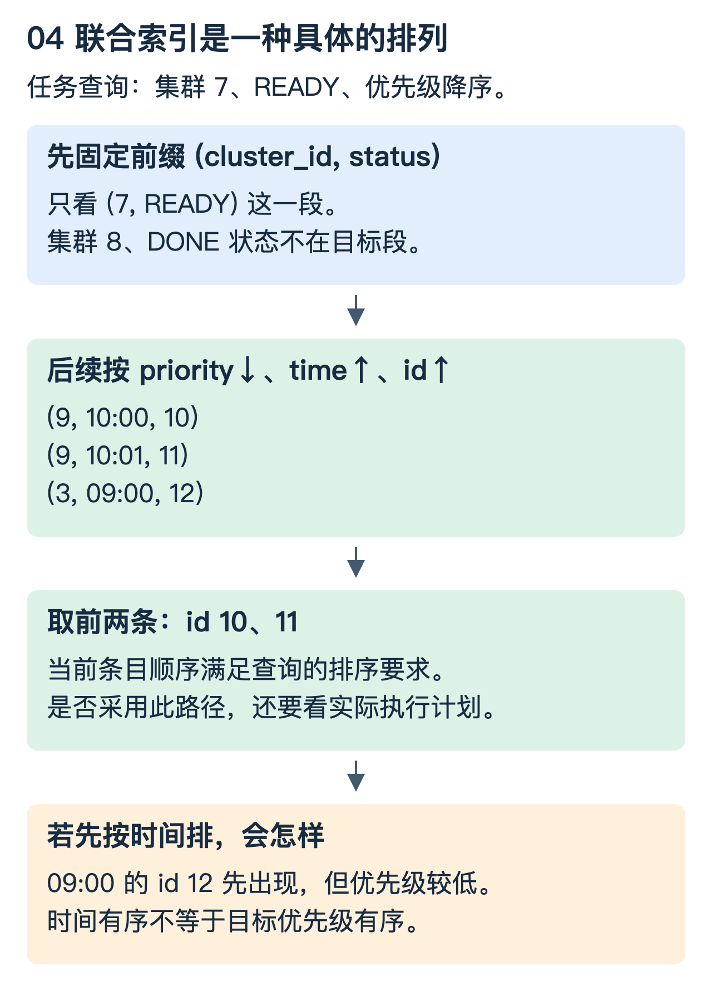

# MySQL：沿着一条任务查询理解索引、排序与事务

以 MySQL 8.4、InnoDB 为参照。问题是：怎样找到某个集群中最优先执行的任务，为什么“有索引”仍会扫描和排序，以及并发事务看到的值为什么不同。

## 1. 先把任务写成五行

| id | cluster_id | status | priority | created_at |
|---:|---:|---|---:|---|
| 10 | 7 | READY | 9 | 10:00 |
| 11 | 7 | READY | 9 | 10:01 |
| 12 | 7 | READY | 3 | 09:00 |
| 13 | 7 | DONE | 10 | 08:00 |
| 14 | 8 | READY | 20 | 07:00 |

需要的是集群 7 中待执行任务，先按优先级从高到低，再按创建时间和 id 从小到大：

```sql
SELECT id, priority, created_at
FROM task
WHERE cluster_id = 7 AND status = 'READY'
ORDER BY priority DESC, created_at ASC, id ASC
LIMIT 2;
```

先手算：结果应为 10、11，不是全表 priority 最大的 14，也不是最早创建的 12。先过滤再排序的语义不能丢。

## 2. B+Tree 为什么适合按范围找数据

把大量有序条目分装在页中，上层页保存定位信息，引导到下层页。一个节点容纳很多键与指针，树就可以比较矮；找到范围起点后，还能沿叶子页扫描有序范围。

InnoDB 聚簇索引的叶子包含行数据；二级索引叶子包含二级键和定位行所需的主键值。没有显式主键时还有选择或生成聚簇键的规则，不能假设任意表总有用户声明的 id 主键。[参考：InnoDB 索引类型](https://dev.mysql.com/doc/refman/8.4/en/innodb-index-types.html)

```text
二级索引 (status, id)：READY → 10, 11, 12, 14
                                │
                       按主键到聚簇索引取整行

如果所需字段已在选中的索引中，就可能避免这次回表。
```

索引不是免费的复制：会占用空间，写入时需要维护，页分裂和缓存占用也有成本。宽主键通常会放大二级索引携带的定位信息，所以主键选型会影响不止一棵树。

## 3. 联合索引首先是一种排序方式

候选索引可以是：

```sql
CREATE INDEX idx_task_pick
ON task(cluster_id, status, priority DESC, created_at ASC, id ASC);
```

前两列由等值条件固定，剩下的条目顺序与目标 ORDER BY 对齐，因此具备顺序取前两条的条件。优化器是否采用，还要看统计信息、数据量、选择列和成本，不能只凭索引名称保证执行计划。



不要用“区分度最高的列永远放最左”代替设计。若把 `created_at` 放最前，虽然时间可能区分度高，却会先按时间组织全表；目标 cluster/status 不再天然形成同样紧凑的前缀范围，还可能失去所需排序。

另一个查询是“最近一小时所有失败任务”，不限制集群。它的访问方式不同，可能需要 `(status, created_at)` 等候选索引。一个索引不必强行兼顾所有查询，要用读写比例、存储成本与实际计划评估。

## 4. 最左前缀、范围、覆盖和 ICP 不要混背

以 `(a,b,c)` 为例，数据先按 a 排，相同 a 内按 b，相同 a/b 内按 c。因此固定 a、b 后很容易沿 c 顺序扫；缺少 a 的普通查找不能自动视为同样高效的连续定位。

如果 a 固定、b 是范围，后续 c 可能仍用于过滤、覆盖或某些优化，但通常不能直接把多个 b 分组内的 c 顺序视为全局 c 顺序。“范围后的列全部失效”过于绝对，要区分缩小扫描范围、过滤、覆盖和消除排序这几种用途。

索引条件下推（ICP）允许符合条件的谓词在索引扫描过程中先判断，减少某些回表；它不代表过滤条件一定都能决定扫描起止，也不是把扫描成本变成零。[参考：ICP](https://dev.mysql.com/doc/refman/8.4/en/index-condition-pushdown-optimization.html)

## 5. filesort 名字里有 file，也不一定落盘

当不能直接利用访问路径得到要求的顺序时，需要额外排序。filesort 是这类排序过程的名称；数据能在相应内存预算中处理时，不必真的写磁盘。较大排序可能产生磁盘临时文件和合并，具体取决于输入与执行配置。[参考：ORDER BY 优化](https://dev.mysql.com/doc/refman/8.4/en/order-by-optimization.html)

`LIMIT 2` 不必然表示只读两行。如果必须先找出所有候选才能确认前两名，就仍要扫描或使用相应 Top-N 排序策略。理解执行计划时同时看访问方式、估计/实际行数、循环次数、过滤与排序，而不是只看 `key` 非空。

### 可以怎样验证

在隔离数据库建立同样的小表，再扩大数据规模与分布，分别比较不同索引的 `EXPLAIN`。使用 `EXPLAIN ANALYZE` 时注意它会实际执行语句，应限制在安全的测试查询与环境。

观察扫描记录量、回表、排序和实际耗时；相同 SQL 在小表与大表选择不同计划不一定异常。不要在生产环境为了“验证一下”贸然建索引、强制索引或清空缓存。

## 6. Buffer Pool 为什么不是一个普通 LRU

磁盘上的索引页与数据页会被缓存到 Buffer Pool。若一个大查询只顺序扫一次大量冷页，简单把所有新页提升到最热位置，就容易挤掉持续被使用的热点页。

InnoDB 使用带新旧区域的 LRU 管理思路，新读入页并非无条件进入最热端，晋升行为还与访问和配置相关。这是抗扫描污染的重要设计，不能只回答“LRU/LFU/FIFO 都有”。[参考：Buffer Pool](https://dev.mysql.com/doc/refman/8.4/en/innodb-buffer-pool.html)

缓存命中与持久化也不同。脏页是内存中已修改、尚需写回对应数据页的页；事务持久性还涉及 redo 等机制。undo 则支持回滚和旧版本读取，不能把 redo、undo 和 Buffer Pool 当成三种同义缓存。

## 7. MVCC：为什么同一行可以读出不同版本

账户初始余额 100。事务 T1 建立一致性读取视图后，T2 把余额改成 80 并提交。T1 再做普通一致性读，会读到什么？

在 InnoDB 的 REPEATABLE READ 下，通常沿用该事务首次一致性读建立的快照；在 READ COMMITTED 下，普通一致性读会使用新的快照。因此不能脱离隔离级别和读取方式回答。“事务开始时间”也不总等于普通快照建立时间。[参考：一致性读取](https://dev.mysql.com/doc/refman/8.4/en/innodb-consistent-read.html)

旧版本来自 undo 等机制配合可见性规则，并不是每次查询都复制整张表。长事务可能延长旧版本保留，使清理压力增大。

`SELECT ... FOR UPDATE` 等锁定读取与普通快照读不同：要按相应锁语义保护将被修改的记录；是否锁范围及间隙取决于索引、查询与隔离级别。不能说“有 MVCC 所以读写永不阻塞”。

任务抢占也不能只做“SELECT 到 READY，再无条件 UPDATE”：两个工作者可能读到同一任务。可以用条件更新检查状态和影响行数，或在合适事务中使用锁定读取。死锁发生后，应按业务幂等边界重试整个事务，并缩短事务、统一锁顺序；重试不是无上限死循环。

### 理解检查

为何这个例子把 cluster/status 放前面？它们确定目标范围，后续顺序满足取任务要求。filesort 必然写文件吗？不必。快照读读到旧值是否说明主从延迟？不一定，本机事务隔离本身就可能产生该结果。
