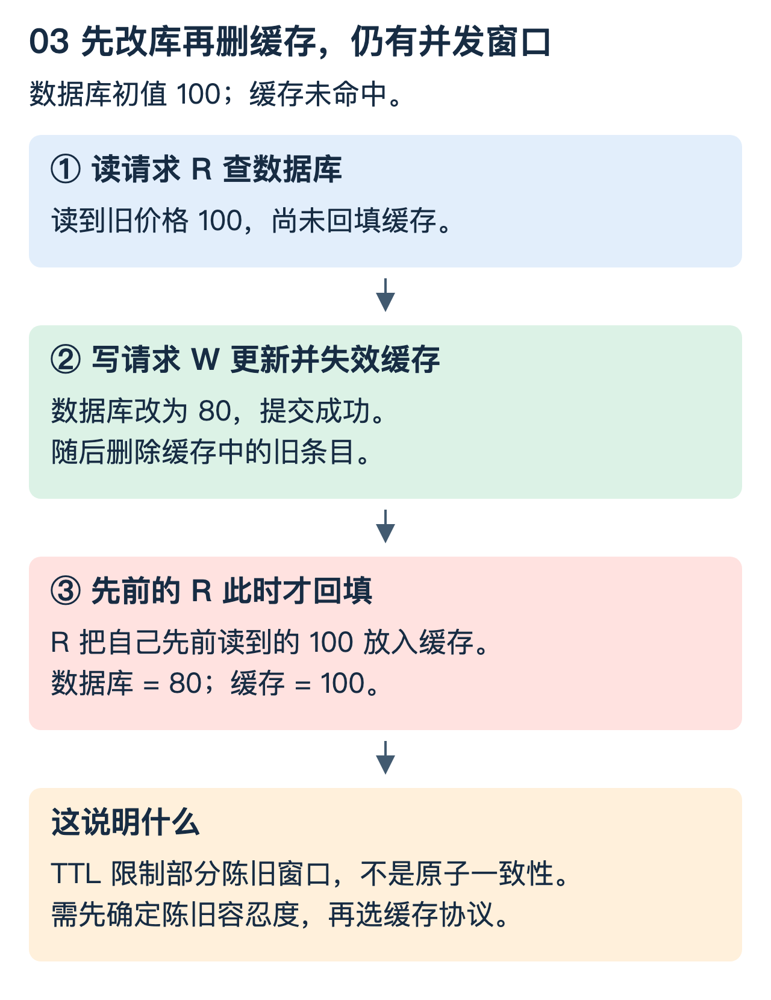

# Redis：从一个慢 key 找到结构、路由与一致性问题

目标不是背出五种类型，而是解释：为什么某个 key 拖慢一个节点，为什么加机器不一定有效，为什么缓存会重新出现旧值。底层编码以 Redis 7.2 系列为主要参照，实际以部署版本及 `OBJECT ENCODING` 结果为准。

## 1. 大 key 和热 key，先分开量

设 key A 保存一个 20 MiB 的值，每秒读取一次；key B 只有 1 KiB，却每秒读取十万次。A 的主要风险是单次工作量和网络大包，B 的主要风险是频率集中。它们可以同时发生，但治理手段不同。

仅计算 B 的值载荷，`100,000 × 1 KiB` 已约为 97.7 MiB/s，尚未包含协议、请求、复制等开销。把“值很小”理解成“不会压垮系统”就错了。

| 现象 | 首先查看 | 不能直接下的结论 |
|---|---|---|
| 单个请求很慢 | 命令工作量、返回字节、客户端等待 | 一定是 CPU 不够 |
| 某节点 CPU 高 | 命令分布、热 key、脚本、过期/持久化事件 | 换机器就能根治 |
| 应用延迟高但慢日志平稳 | 网络、连接池、排队、客户端 GC | Redis 执行一定很慢 |
| 内存增长 | key 数、值大小、编码、碎片与缓冲 | 必然是泄漏 |

## 2. 逻辑类型不等于底层编码

String 可以保存二进制数据，也可能以整数编码优化；Hash、Set、ZSet 等小对象可能使用紧凑编码，达到条件后换结构。不能说一个逻辑类型永远对应一种物理表示。[参考：Redis 内存优化](https://redis.io/docs/latest/operate/oss_and_stack/management/optimization/memory-optimization/)

Redis 7.2 的 List 实现围绕 quicklist：外层组织节点，节点可承载紧凑的 listpack 等数据表示；大元素等情况有专门处理。它不是“给每一个元素分配一个普通双向链表节点”，也不是一个可以无条件 O(1) 随机下标访问的数组。[源码：Redis 7.2 List](https://github.com/redis/redis/blob/7.2.0/src/t_list.c)

```text
逻辑 List：a, b, c, d, e
一种简化物理视图：
quicklist 节点 1 [a b c] ↔ 节点 2 [d e]
                  紧凑块            紧凑块
```

紧凑表示减少指针与分配开销，代价可能是块内查找或移动。实际节点大小与压缩策略依赖配置，图只是结构解释。

较大 ZSet 常见的组合是字典与跳表：字典便于按成员找到分数，跳表维护按分数/成员排序的结构，支持有序范围访问。跳表从稀疏高层跳过不可能区间，再向低层细查；不是额外建立一个能任意下标访问的数组。小 ZSet 可使用其他紧凑编码，不应遗漏条件。

## 3. Cluster 路由为什么让一个热 key 留在一台主节点

Redis Cluster 把 key 映射到 16,384 个哈希槽，再由槽映射到服务节点；普通 key 的槽计算使用 CRC16 后取模。花括号 hash tag 会改变参与计算的部分。原生 Cluster 客户端维护槽映射并处理 MOVED/ASK 等重定向，不能泛化成所有 Redis 部署都存在同一层代理。[参考：Redis Cluster 规范](https://redis.io/docs/latest/operate/oss_and_stack/reference/cluster-spec/)

如果 90% 流量都读一个 key，它仍主要集中在负责该槽的节点。增加节点可分摊其他槽，不会自动把一个 key 的写入拆成多主并行。

可选治理包括读侧本地缓存、请求合并、降低更新频率，或在业务语义允许时拆分数据。拆成多个 key 后，聚合读取、原子修改、复制一致性和失效广播会更复杂。读副本可以分担部分读取，但必须接受并处理复制延迟。

## 4. 怎样排查，而不是直接删 key

先做低影响检查：命令统计、CPU、内存、网络、连接数和应用侧按 key 聚合的延迟/流量。再有针对性查看 `SLOWLOG GET`、`INFO`、`MEMORY USAGE key`、`OBJECT ENCODING key` 以及对应类型长度。慢日志关注命令执行，不覆盖全部客户端端到端等待。[参考：Redis 延迟诊断](https://redis.io/docs/latest/operate/oss_and_stack/management/optimization/latency/)

`SCAN` 是增量扫描，不是零成本、原子快照；全库扫描仍需限速并选择窗口。`redis-cli --bigkeys` 的统计口径也不等于所有类型都直接按真实内存字节排序。不要在大生产库上随手用 `KEYS *` 或长时间 `MONITOR`。

止血优先限制异常访问、降低大返回、切走可降级逻辑，而不是未经确认删除业务数据。异步释放命令可以降低某些删除阻塞，但是否可以删、删后是否触发重建风暴仍是业务判断。

## 5. 缓存为什么会被旧数据重新填回来

常见 cache-aside：读缓存，没命中就查数据库并回填；更新时先改数据库，再使缓存失效。这很实用，但不是跨系统原子协议。



图中最终数据库是 80，缓存却是 100。顺序并没有违反“先更新数据库再删缓存”，问题出在并发旧读取。

TTL 可以限制部分陈旧时间，但不是严格实时保证。延迟双删依赖时序假设，不能证明任意长暂停下都正确。更严格的设计可以使用变更流驱动缓存、版本化条目及原子条件更新，但必须保留足够的版本信息；缓存条目被删后版本也消失，仍可能允许旧值回填。关键事实可绕过缓存读取权威源，代价是更高延迟与容量需求。

因此要先说清“允许旧几秒”“更新后自己的读取要不要立即看到”“跨实例是否必须一致”，再选择协议。

## 6. 击穿、穿透、雪崩对应不同输入

- 热点条目过期，大量请求同时回源：可合并同 key 的加载，并限制回源并发；这是击穿问题。
- 查询根本不存在的 key：可用短期空值缓存、校验或布隆过滤降低无效回源；布隆过滤可能误判存在，不能据此返回不存在的数据。
- 大批条目同时失效，或缓存整体故障：打散到期时间、容量预留、分级降级与回源限流；只给 TTL 加随机数不能解决整个缓存集群不可达。

本地缓存把读流量分散，也增加副本数量与失效传播成本。容量限制、最大陈旧时间、进程重启预热和失效事件丢失，都要一起考虑。

## 7. 持久化、复制和消息确认各管什么

RDB 是某时刻的快照，AOF 记录写入以供恢复；具体丢失窗口与刷盘策略、故障类型有关。复制和主从切换用于可用性，不能自动消除异步复制的丢失窗口，也不能替代独立备份。误操作一样可能传播。

若用 Stream 做任务队列，消费者组交付后会维护待确认消息；`XACK` 表示从待确认列表移除，不等于把业务副作用一起提交。消费者死后可用相应认领机制接管超时任务，但接管也可能导致重复执行，仍需业务幂等。[参考：XAUTOCLAIM](https://redis.io/docs/latest/commands/xautoclaim/)

这和 Kafka 的结论一致：可靠队列能帮助重放，不能替外部系统自动完成原子业务动作。更完整的边界推演见 [Kafka 数据链路](Kafka到检索引擎_数据链路与高可用.md)。

### 理解检查

容量很小但访问极热的 key，扩节点是否必然有效？不是，先看访问是否能跨副本或分片分散。更新数据库后删缓存是否绝对一致？不是，画出旧读取回填的时间线即可找到反例。Stream ACK 成功能否证明下游业务成功？只有应用协议保证了正确顺序，单凭 ACK 不够。
