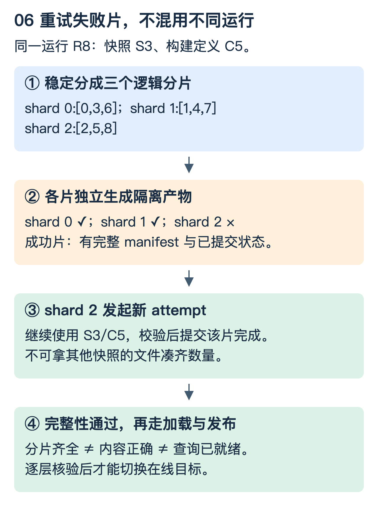

# 分布式任务：把大工作拆开，还要能从失败处继续

这一篇回答：为什么把任务分到十台机器，不等于获得十倍加速；为什么加一把分布式锁，也不等于任务只会生效一次。以索引产出为例，但同样适用于导出、离线计算与文件发布。

## 1. DUMP、Build、分发处理的不是同一种对象

设数据源有商品表与类目表。目标引擎需要三份分片索引。

| 阶段 | 输入 | 输出 | 典型验证 |
|---|---|---|---|
| DUMP | 固定范围的数据快照、转换定义 | 标准化文档与分片清单 | 主键、字段、数量、拒绝记录 |
| Build | 标准化文档、schema、分析/模型配置 | 引擎可加载的索引文件 | 文件清单、校验和、格式与可打开性 |
| 分发/加载 | 已完成的产物、目标集群与代次 | 目标节点上的索引和加载状态 | 分片覆盖、实际版本、可查询性 |

任务退出码成功只证明进程认为自己成功；不证明所有文件齐全、所有节点都加载了正确版本，更不证明内容符合业务语义。每个阶段都需要自己的可核验产物。

## 2. 用九条记录推演分片

商品 ID 为 0—8，固定三片，用 `id % 3`：

```text
shard 0：[0,3,6]
shard 1：[1,4,7]
shard 2：[2,5,8]
```

这个规则在该快照中覆盖全部记录且不重叠。真实系统还要处理主键分布、热点、大文档与任务成本不均；条数相同不等于耗时相同。按可变的机器数量直接取模，会在扩缩容时改变归属，因此通常先定义稳定逻辑分片，再把分片分配给工作者。

## 3. 并行度由瓶颈决定，不是由机器清单决定

假设串行准备 20 秒，可并行工作单机需要 80 秒。四个工作者在完全均衡、无额外开销时，总时间为 `20 + 80/4 = 40` 秒，仅 2.5 倍加速，不是 4 倍。

如果数据源最多每秒提供 1GB，十个工作者合计要求每秒 10GB，瓶颈就转到读取。对象存储写入、构建 CPU、分发网络都可能成为新的上限。端到端耗时还含排队、启动、下载依赖、重试与最慢分片尾部。

因此每片至少记录输入大小、记录数、各阶段耗时、CPU/内存、读写字节和重试。按数据倾斜重分片有助于长尾，但也增加调度与合并开销。

## 4. 崩在中间，怎样知道哪些可复用

一次运行定义 `run_id=R8`，输入快照为 S3，构建配置为 C5。每个分片有自己的 attempt；一个失败重试不会覆盖另一尝试正在写的临时产物。



先预测：shard 2 失败了，需要重做 shard 0、1 吗？只有它们的输入、构建定义仍一致，产物完整且可验证，才可复用。如果整个输入快照已经换了，就不能因为文件名相同而混入新运行。

推荐把临时输出与已提交产物分开：工作者先写隔离路径，生成 manifest，校验后再通过条件更新提交“此分片完成”。manifest 可包含 run/shard/attempt、输入指纹、schema/模型/引擎格式、文件列表、尺寸和校验和。

文件 checksum 证明字节符合预期，不证明漏掉的业务记录不存在。数量、主键范围、抽样内容、引擎可读性与查询验收还要单独检查。

## 5. DAG 只规定依赖，不自动实现可靠恢复

三片 DUMP 可以并行，各片 Build 等待对应输入；最终发布门槛等待全部必要产物。状态可设计为 PENDING、RUNNING、SUCCEEDED、FAILED，并记录租约、尝试编号和失败类型。

调度器恢复时读取持久状态，识别未完成或租约失效的任务。旧工作者可能仍在跑，所以“重新派发”不等于旧执行者消失。每次状态推进要验证预期状态及执行代次，避免过期 attempt 把新的状态覆盖成成功或失败。

重试也需要分类：瞬时网络问题适合有限退避；输入损坏或格式不兼容需要修复定义；资源不足可能需要排队或容量调整，不宜让所有任务同时无限重试。

## 6. 为什么分布式锁还需要 fencing

按时间线看：

```text
工作者 A 获得租约与令牌 41 → 长时间暂停
租约过期，工作者 B 获得令牌 42 → 写入新状态
A 恢复，仍以为自己有权 → 尝试用 41 写入
```

如果目标只检查“A 有没有在客户端拿过锁”，就挡不住最后一步。fencing 的关键是**被保护的目标系统**持久记录或验证当前有效代次，原子拒绝过期令牌；令牌必须来自可依赖的单调分配/所有权协议，不是各机器拿时间戳随便拼。

租约续期、条件更新与线性一致存储可以构成协调基础，但控制存储的保证不会自动延伸到外部文件或引擎写入。需要分别说明边界。[参考：etcd API 一致性保证](https://etcd.io/docs/v3.5/learning/api_guarantees/)

文件系统或对象存储场景常用“不可变产物 + 条件更新发布指针”：旧尝试可能留下孤立文件，但不能越权改变当前版本。之后可按引用与保留策略清理，不应把“重复计算”和“重复发布生效”混为一谈。

## 7. 省资源的数字必须分口径

有 100 个业务，各常驻 8 核，固定预留为 800 核。若一天每个业务只构建 1 小时，按需调度可以显著减少闲置预留，但不表示构建本身所需总核时消失。

| 指标 | 表达什么 |
|---|---|
| 预留核数 | 长期占着多少可分配容量 |
| 峰值核数 | 某时刻最多同时使用多少核 |
| 核时 | 核数对运行时间的积分 |
| 完成耗时 | 用户从提交到拿到结果的等待 |
| 实际费用 | 结合计费、存储、网络和闲置规则的成本 |

减少预留、增加峰值、保持总核时，完全可能同时发生。容器冷启动、镜像拉取和数据下载还可能让小任务变慢，需比较整体工作负载而非只看资源数字。

## 8. 构建成功之后还缺哪些门槛

确保目标分片覆盖完整、期望副本已加载正确代次、必要增量追赶完成、查询可见性达标，再受控更新流量指向。原子更新元数据不表示所有在途查询瞬间切换；旧请求、缓存和回滚窗口仍需协议。

全量与增量接续单独阅读 [Kafka 数据链路第 10 节](Kafka到检索引擎_数据链路与高可用.md)。这里不重复复制，而是把“产物完成”与“在线数据正确”两个门槛连接起来。

### 理解检查

三片中一片失败，另外两片能复用的依据是什么？稳定输入、兼容配置和可验证完整产物。锁到期后的旧工作者靠什么被拒绝？下游验证的新代次，而不是旧工作者的自觉。预留核数降低十倍是否代表总计算量降低十倍？不代表。
