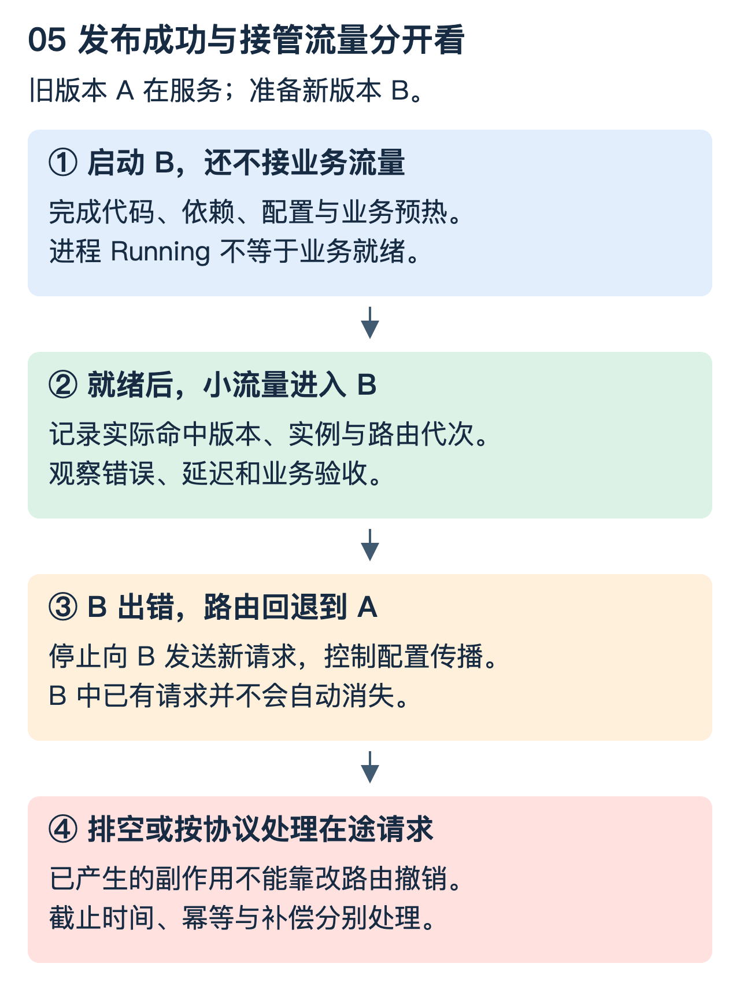

# 容器与服务治理：让一个版本出错时，其他请求还能工作

本篇从一个具体故障开始：版本 B 出现死循环，而版本 A 正在处理正常请求。怎样限制影响，又怎样把流量安全切回 A？以下资源文件示例以 Linux cgroup v2 为参照；部署流程采用 Kubernetes 的概念，但不提供可直接用于生产的配置模板。

## 1. 隔离其实有三个不同问题

第一是“看得见什么”，例如进程编号、网络、挂载目录。第二是“能用多少”，例如 CPU 时间和内存。第三是“谁和谁一起崩溃”，例如两个版本是否共用一个 JVM。

namespace 主要提供系统资源的不同视图：PID、network、mount、IPC、UTS、user 等各自负责不同对象。cgroup 则负责进程分组及资源控制、统计。容器不是简单换一个根目录；容器也通常共享宿主机内核，并不等同于独立虚拟机。[参考：Linux namespaces](https://man7.org/linux/man-pages/man7/namespaces.7.html)

| 方案 | 缩小了什么影响 | 没有自动解决什么 |
|---|---|---|
| 不同 ClassLoader | 类身份与依赖可见性 | CPU、堆和进程故障 |
| 不同进程 | 语言运行时和地址空间 | 宿主机资源争用 |
| 进程 + 资源约束 | CPU/内存等消耗上限 | 内核、节点、共享存储或网关故障 |
| 不同节点/故障域 | 部分共同失效来源 | 跨节点公共依赖与错误发布 |

因此“换成容器就完全隔离”不成立。要沿着应用、进程、节点与公共依赖继续找共享点。

## 2. 0.5 核究竟是什么意思

假设某 cgroup 的 `cpu.max` 为 `50000 100000`。含义是在 100,000 微秒的周期内，可用总 CPU 时间配额为 50,000 微秒；它不是“绑定半个物理核心”。线程可短时间在多个核上运行并较快耗尽配额，随后被节流。

若宿主机总体 CPU 不高，但该服务延迟增大，仍需查看自身 `cpu.stat` 的节流统计及其变化。内存约束则应结合 `memory.current`、`memory.max` 和 `memory.events` 理解；达到限制后的回收和 OOM 行为与资源控制规则有关，不等于 JVM 总会先抛出堆 OOM。[参考：cgroup v2](https://docs.kernel.org/admin-guide/cgroup-v2.html)

这些路径必须对应实际进程所在 cgroup。不同挂载、容器与运行时环境下位置不同，不能把宿主机根组数据当作某个容器的数据。

## 3. Proxy 路由多版本时，先把映射写出来

一次请求至少要能追踪：业务场景、选中的版本、路由配置代次、实际实例和请求 ID。

```text
场景 S + 实验分组 → version B
version B + 路由配置 epoch 12 → 已就绪实例 {B1, B2}
选择 B1 → 执行 → 记录实际命中 B1/version B/epoch 12
```

“配置切到 B”不表示所有 Proxy 同一瞬间切换；“B 的进程起来”也不表示它已加载依赖并可以接流量。控制面期望状态、实例实际状态和请求实际路径必须能够对账。



先预测：灰度发现错误，把路由从 B 改回 A，B 中正在执行的扣库存请求是否会自动撤销？不会。路由只影响请求去向，业务副作用需要自己的事务、幂等或补偿协议。

## 4. 发布和下线是一段状态变化

新版本可按“创建 → 启动 → 初始化 → 就绪 → 小流量 → 扩量”推进。失败时停止继续放量，保存观察证据，必要时回退路由。不能用“容器 Running”代替依赖就绪或业务验收。

下线时，要停止新请求进入，再在期限内排空旧请求，最后退出。终止信号、生命周期钩子、端点更新和实际请求排空之间不是天然零延迟的串行事务；连接复用和端点传播都需要处理。Kubernetes 的终止宽限期不是等到所有请求都完成的无限承诺。[参考：Pod 生命周期](https://kubernetes.io/docs/concepts/workloads/pods/pod-lifecycle/)

readiness 表达是否适合接流量，liveness 用于判断是否需要重启，startup 用于处理启动阶段。把临时下游故障直接变成所有实例的存活失败，可能制造重启风暴。

## 5. 异步化为什么还会堆积

每秒 100 个请求，平均等待下游 2 秒，在相对稳定条件下，平均约有 200 个请求在系统里。异步 I/O 能减少等待占用的工作线程，不会让这 200 个请求状态、连接和下游工作凭空消失。

需要一起限制在途请求、队列、连接池与下游并发，并设置端到端 deadline。下游还有 200ms 才超时，而上游只剩 50ms，就不能无视剩余预算再启动一次完整重试。

若三层各自最多尝试三次，极端情况下最底层一次逻辑请求会接到 27 次尝试。应集中重试职责，使用退避与抖动，按幂等条件判断是否能重试，并在过载时快速失败或降级。

限流控制进入系统的工作量；熔断针对持续失败的依赖暂缓请求；降级改变提供的功能或结果；超时限制等待时间。它们解决不同问题，不应全部叫“兜底”。

## 6. HPA 为什么不是过载万能药

一个简化计算：当前 4 个实例，平均 CPU 利用率 80%，目标 50%，建议副本数约为 `ceil(4 × 80/50) = 7`。真实控制器还考虑缺失指标、未就绪实例、稳定窗口等因素；CPU 利用率口径通常与 requests 有关。[参考：HPA 算法](https://kubernetes.io/docs/concepts/workloads/autoscaling/horizontal-pod-autoscale/)

扩实例需要调度、拉镜像、启动和预热；如果瓶颈是共享数据库或热分片，扩上游反而可能增加压力。长请求系统也可能 CPU 很低但并发已满，应该考虑与容量关联更强的指标，而不是只盯 CPU。

## 7. 线上排障要把等待拆开

把总时间拆成入口排队、路由、连接获取、网络、后端计算及响应传输。先确认变慢的是哪一段，再决定工具和处置。

- CPU 问题：对照进程/线程 CPU、节流、线程栈与采样，不用 load average 直接等同 CPU 使用率。
- 内存问题：对照应用堆、原生内存、容器计费内存与 OOM 事件。
- 网络问题：看连接池等待、DNS、握手、重传和下游延迟；本机执行快不代表网络返回快。
- 发布相关：对齐配置代次、镜像/代码版本、实例年龄与首次错误时间。

诊断命令也有开销和权限边界；线程 dump、抓包、性能采样需评估影响及敏感数据。先保留证据再做可控止血，不能以“重启后好了”代替根因。

### 理解检查

节点 CPU 30%，服务仍被 throttling，矛盾吗？不矛盾，服务受自己的配额限制。路由回退等于事务回滚吗？不是。异步化以后仍要限并发吗？要，等待中的状态与下游容量仍有限。
