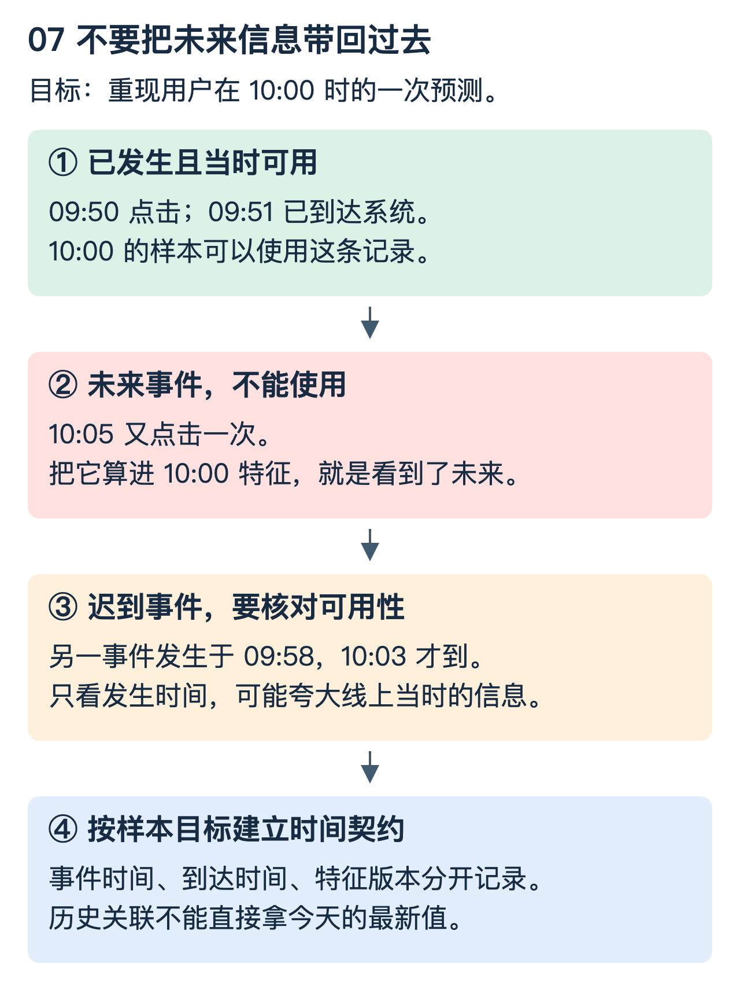

# 搜推系统：特征从什么时候来，结果到底好在哪里

索引能返回文档，只说明系统能找；这一篇回答怎样判断“找得对、排得好、值得上线”。先读一个小例子，再区分召回、排序与业务实验。

## 1. 四件商品，为什么需要多层筛选

候选商品为 A、B、C、D。某个用户真正相关的集合是 `{A,C}`。召回返回 `[A,B,C]`，较便宜的粗排只留下 `[A,B]`，精排再认真排序，也无法恢复已经被移除的 C。

召回扩大有用候选覆盖；粗排在预算内保留值得精算的候选；精排用更复杂的特征和模型；重排再考虑多样性、业务规则或整体列表约束。并非每个系统都必须有四个独立服务，层数取决于数据规模、成本和时延。

“召回越多越好”只有在其他资源和质量约束允许时才可能成立。候选增加会带来特征读取、计算与排序成本，也可能引入噪声。更复杂的精排不能弥补所有早期遗漏。

## 2. 用同一组数字区分指标

相关集合 `{A,C}`，返回前三条 `[A,B,C]`：

```text
Precision@3 = 命中相关数 / 返回数 = 2/3
Recall@3    = 命中相关数 / 全部相关数 = 2/2 = 1
```

分母不同，关注点也不同。真实数据中未标注不一定是不相关，标注池不完整会使指标有偏差，应说明标注范围。

如果相关等级为 `A=3、C=2、B=0`，用增益 `2^rel-1`、折扣 `log2(rank+1)`：

```text
DCG([A,B,C]) = 7/1 + 0/log2(3) + 3/2 = 8.5
理想 [A,C,B] 的 DCG = 7 + 3/log2(3) ≈ 8.8928
NDCG@3 ≈ 0.9558
```

同样命中两个相关项，把高相关结果放得更靠前可以得到更好分数。不同任务可能选用不同增益定义，比较时必须一致。详细检索指标与融合见 [检索引擎基础](检索引擎基础.md)。

### 粗排如何对齐精排

在固定候选集合上，假设高成本精排认为最好的两件是 `{A,C}`，粗排留下 `{A,B}`，则这个例子对精排 Top-2 的保留率是 1/2。这能度量“便宜模型有没有留下贵模型想要的对象”，但精排本身也可能有偏差，不能把它当绝对真理。还应看实际业务标签、分场景质量与资源预算。

AUC 比较正例得分高于负例的概率性质，不直接等于某次查询 Top-K 体验；总体 AUC 还可能掩盖不同用户或场景的差异。MRR 关注第一条相关结果的位置，MAP 会综合相关项所在位置。指标选择要围绕任务，不是越多越专业。

## 3. 特征穿越：把未来答案带回过去

假设要模拟 10:00 的预测。用户在 09:50 点击一次、10:05 又点击一次。训练样本的“过去点击次数”能否算 2？不能，10:05 的变化尚未发生。



更隐蔽的是：事件发生在 09:58，却到 10:03 才被处理并在线可用。只检查 `event_time <= 10:00`，仍可能让离线样本看到线上当时看不到的信息。因此要区分事件时间与可用时间；是否需要严格复现当时在线可见性，取决于训练与回测目标。

Point-in-time join 的基本思想是对每个样本时间向过去找符合条件的特征版本，而不是把今天的最新特征直接连到所有历史样本。工具的时间与 TTL 规则要核对，不能凭名称假定其处理了所有迟到数据语义。[参考：Feast 时间点关联](https://docs.feast.dev/getting-started/concepts/point-in-time-joins)

## 4. 线上线下一致性不只是“用了同一张表”

同一个“最近七天点击数”，以下差异都可能让结果不一致：窗口是否包含当前时刻、时区、去重键、迟到处理、默认值、空值编码、特征版本、实体 ID 和刷新频率。

应保存特征定义版本与样本时间，构造固定实体/时间的黄金用例，同时跑离线与在线计算或可重放版本，对比值及输入范围。模型训练与在线服务还要使用兼容的特征顺序、单位、归一化及编码；“两边都是浮点数组”远远不够。

对于已无法恢复的历史特征，不能事后用最新值悄悄补齐并当作无偏评估。可以明确标识缺失、改变评估范围，或建设未来可追溯的数据留存。

## 5. 分了流量，不等于完成了 A/B 实验

一次请求被路由到版本 B，只说明系统选中了一个执行路径。要判断 B 是否改善结果，还需随机化单元、稳定分组、曝光日志、结果归因、主指标与护栏。

例如按用户稳定分组，而不是每次请求随机摇一次，可避免同一用户频繁跨组造成体验与归因混乱。但若用户之间会互相影响，还需要进一步考虑实验干扰。多处改动组成同一实验版本时，也要让分组决策贯穿相关链路。

设 A 组有 10,000 次曝光、500 次点击，B 组有 10,000 次曝光、530 次点击。CTR 分别是 5% 和 5.3%，绝对差为 0.3 个百分点，相对提升为 6%。这只是点估计，不足以宣布显著提升；要考虑随机化单元、相关性、样本量、置信区间与预定分析方式。

如果目标 50:50 分组，实际却长期显著偏离，应先调查分组/日志是否存在样本比例异常，而不是直接解释指标差异。反复查看直到显著、多指标挑最好看的、忽略实验期间流量变化，都可能产生错误判断。[参考：Microsoft 实验实践](https://learn.microsoft.com/en-us/xbox/playfab/live-service-management/game-configuration/experiments/experimentation-keys)

主指标可以是业务转化，护栏可包括错误率、P99、成本与负反馈。点击率提升但成交下降或违规增多，不一定值得上线；离线排序改善也不能替代在线验证。

## 6. 把“效果变差”拆成可定位的问题

先核对数据、样本与埋点，再查特征一致性；然后逐层比较召回覆盖、粗排保留、精排顺序与重排规则，最后看实验归因。不要只看到 CTR 下跌就立即调模型。

每个查询保存可控、脱敏的候选阶段信息及版本标识，可帮助确认“相关项在哪一层消失”。样本应覆盖高频、长尾、冷启动、带过滤条件等切片，不能只看总体平均。

### 实验与理解检查

运行 `python3 examples/foundation_algorithms.py`，`ranking_demo` 复现本篇 Precision、Recall、NDCG 的数值，并打印粗排保留率。

训练时使用“用户最终是否购买”作为标签合理吗？可以，但把购买后才知道的属性作为购买前预测特征就可能泄漏。NDCG 改善就一定转化更高吗？不是，标签、流量和业务目标可能不一致。稳定分流完成后，是否已有可信实验结论？没有，还缺观测与统计验证。
