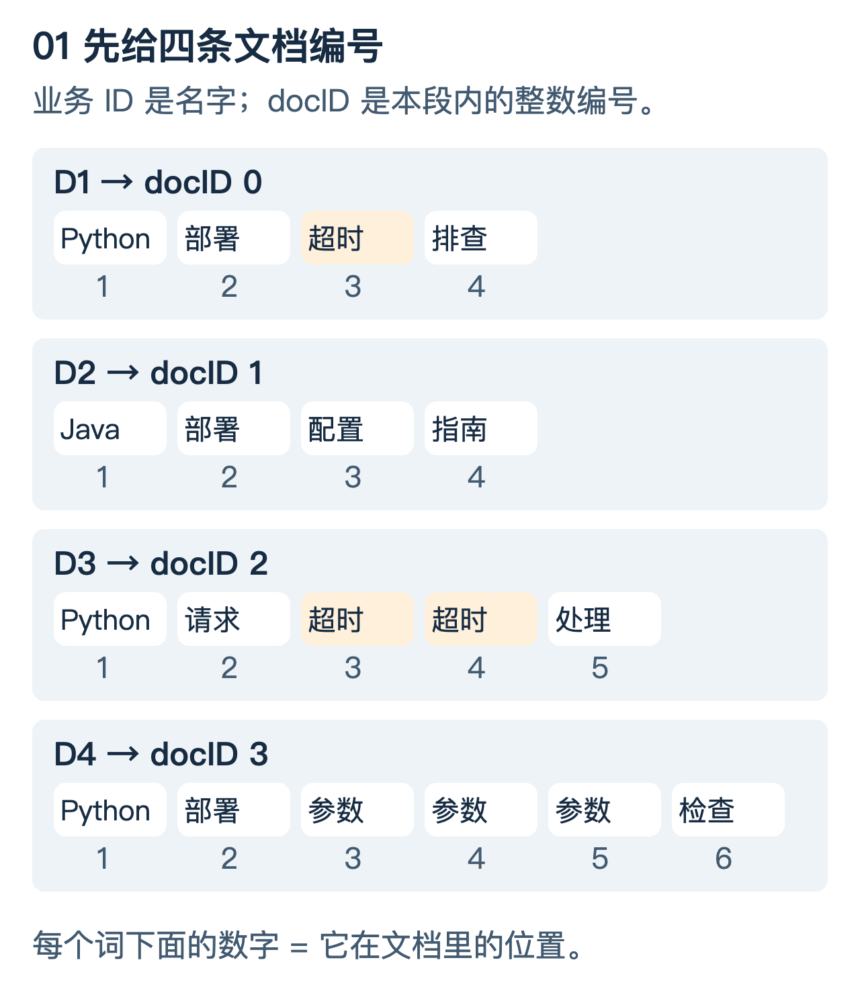
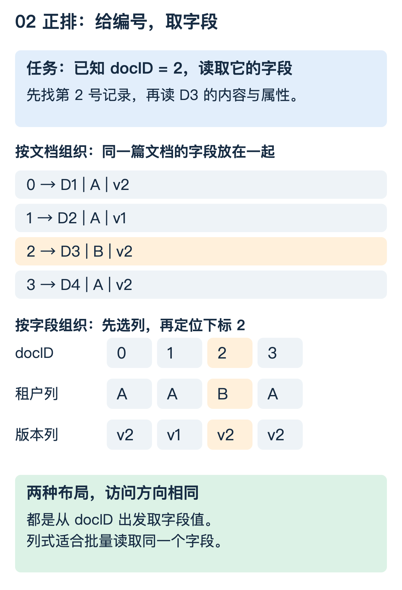
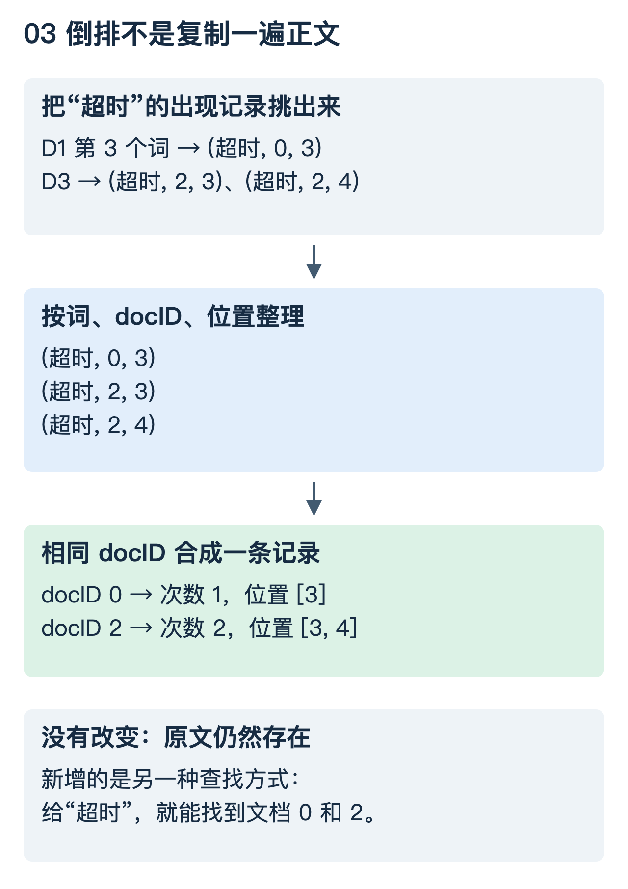
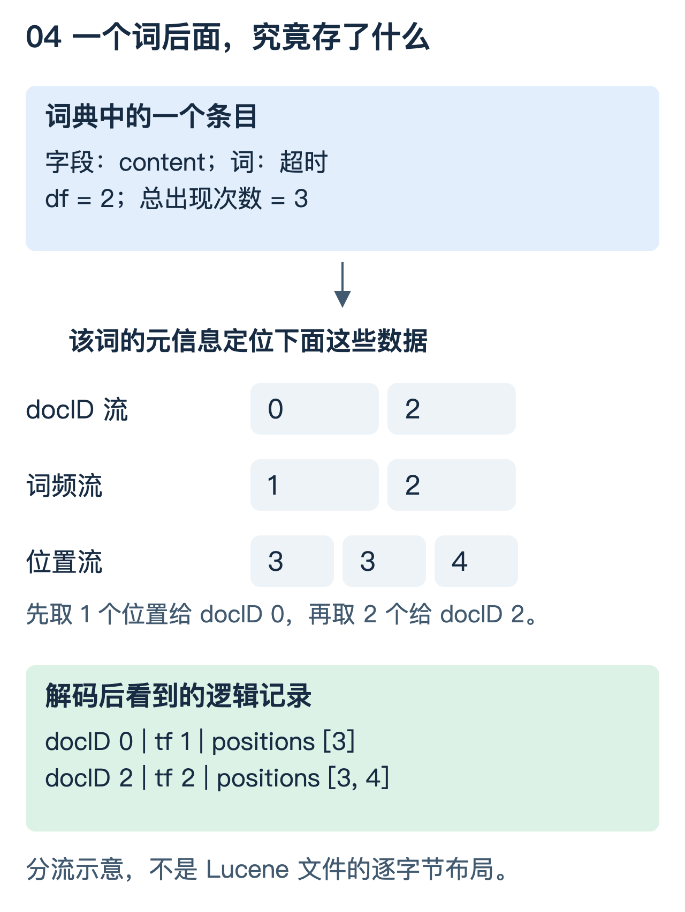
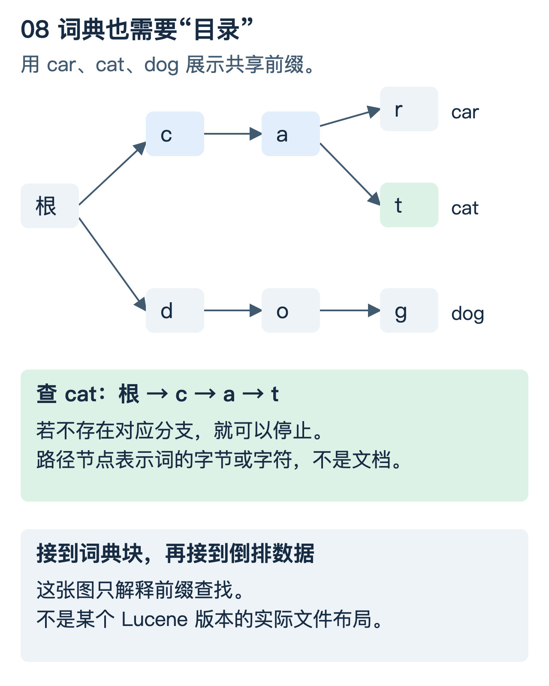
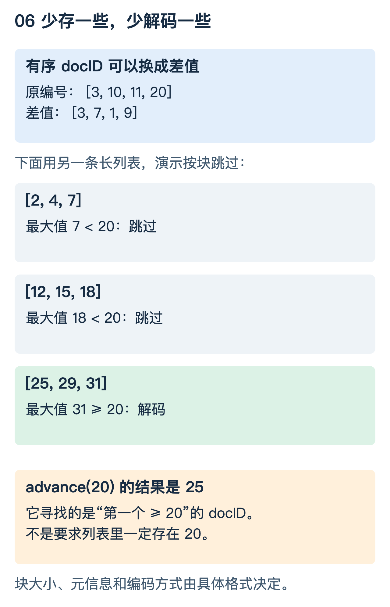
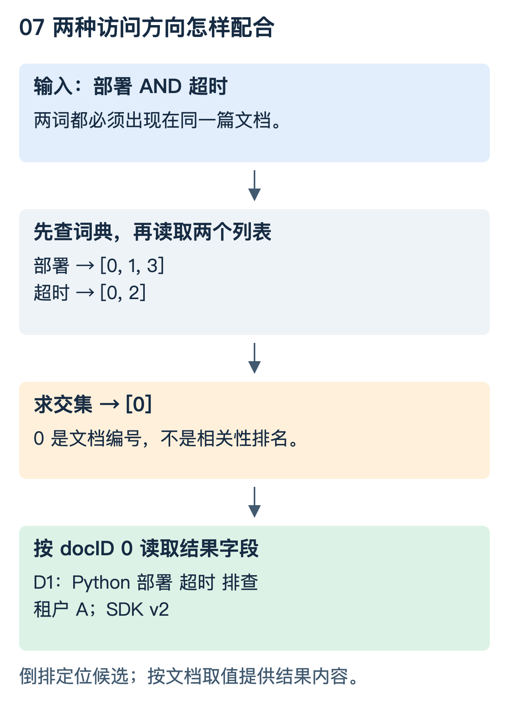

# 索引结构图解：正排与倒排究竟存了什么

这篇先只解决一个问题：**给定“部署”和“超时”两个词，系统怎样在不逐篇阅读正文的情况下找到 D1，然后取出它的内容？**

我们不用“输入 → 检索 → 输出”这样的总流程代替内部解释，而是把文档编号、词典、数组、位置和游标逐个展开。

图中的数据沿用[检索引擎基础](检索引擎基础.md)中的四条文档。图片旁的文字也保留了关键数值，可以对照阅读。它们是逻辑结构和算法示意，不是某个引擎文件的逐字节复刻。

## 1. 先想象两种查书方式

你知道“第 20 页”，就直接翻到这一页，读它的内容。

你只知道一个词，就翻到书后的关键词索引，找到它出现在哪些页，再按页码翻回正文。

这两种方式的区别不是内容不同，而是**手上已知的信息不同**：

- 已知页码，取内容。
- 已知词，取页码，再取内容。

把页码换成文档编号，就接近正排和倒排的访问方向。但类比到这里就停下：真实引擎的内部编号可能随合并而变化，文档也未必按一个完整字符串连续存放。

## 2. 先把四条文档变成能画出来的数据



这里人为设定一个索引段，给 D1—D4 分配内部整数编号 0—3。不要把 D1 中的数字 1 与 docID 1 混淆：**D1 的内部编号是 0，D2 的内部编号才是 1。**

为什么不用完整业务 ID 到处传？整数更适合排序、比较、压缩和按位置取值。业务 ID 保留为可返回的字段，内部 docID 用来组织这个索引段的数据。

还有另一套数字：词在文档内的位置。本例位置从 1 开始；例如 D3 中两个“超时”位于第 3、4 个位置。这不是 docID，也不是文件字节偏移。

### 先预测一下

“超时”出现于 D1 和 D3，其中 D3 写了两次。那么查“包含超时的文档”时，D3 应该返回两次，还是一次？

先记住你的判断，第 4 节会把它怎样保存画出来。

## 3. 正排不是只有一个 `Map<id, 文档>`

### 3.1 先看访问方向，再看具体布局

假设查询已经告诉我们“命中文档 2”。接下来要知道它的正文、租户或 SDK 版本。



图的上半部按文档排列：读第 2 号记录，可以得到 D3、租户 B、版本 v2。

图的下半部按字段排列：租户列为 `[A, A, B, A]`，版本列为 `[v2, v1, v2, v2]`。读这两列的下标 2，同样得到 B、v2。

这两种布局都支持“文档编号 → 字段值”，但取数成本不同：

- 展示一条结果的多个字段，按文档组织的结构比较直观。
- 为许多候选取同一列做排序或聚合，按字段组织可以避免读取大量无关字段。

“正排”描述的是访问方向，不能据此断言它一定是哈希表、一定按行存，或者所有正排数据都在内存里。

### 3.2 字符串长短不同，怎么按编号找到记录

如果每条记录长度相同，可以由固定步长直接计算位置。若记录长短不同，一种教学实现是额外保存边界数组：

```text
offsets = [0, 20, 38, 65, 94]       ← 4 条记录的 5 个边界

docID 0 使用字节区间 [ 0, 20)
docID 1 使用字节区间 [20, 38)
docID 2 使用字节区间 [38, 65)       ← 读取这里
docID 3 使用字节区间 [65, 94)
```

已知 docID 2，先读 `offsets[2]` 和 `offsets[3]`，再读取对应范围。

这些偏移是人为设定的示例，不是四条中文文档的真实编码长度。真实存储还可能按块压缩：先定位块，再解压并定位块内记录，而不是每篇文档都可以独立读取一段未经压缩的字节。

现在你看到的不是一句“正排可以取文档”，而是一个具体实现办法：**编号 → 边界或块位置 → 字节 → 解码后的字段。**

### 3.3 列式字符串也不必重复存完整文字

租户列只有 A、B 两个不同值，可以先建一个值字典：

```text
值字典：  0 → A，1 → B
编码列： [0, 0, 1, 0]
                    ↑
              docID 2 对应编码 1 → B
```

这里的 0、1 是字段值的编号，通常叫 ordinal，**不是文档编号**。它们只是碰巧也用了整数。

在 Lucene 的部分 doc values 类型中，字典与 ordinal 是实际采用的思路；具体布局还取决于字段类型、是否多值、缺失值和压缩方式。缺失值不能随便拿 ordinal 0 表示，否则会和第一个真实值混淆。[参考：Lucene doc values 格式](https://lucene.apache.org/core/10_3_1/core/org/apache/lucene/codecs/lucene90/Lucene90DocValuesFormat.html)

### 3.4 与 Elasticsearch 名词怎样对应

| 名词 | 主要作用 | 不要混淆 |
|---|---|---|
| `_source` | 提供文档源内容；配置不同可能存储或重建 | 不是倒排，也不等于 doc values |
| stored fields | 按文档取已存储的字段 | 不是“所有字段都自动单独存储” |
| doc values | 字段的列式访问，服务排序、聚合等场景 | 不是原始 JSON 的完整副本 |

所以“正排就是 `_source`”和“正排就是 doc values”都把一个通用访问方向缩成了某个具体实现。[参考：Elasticsearch doc values](https://www.elastic.co/docs/reference/elasticsearch/mapping-reference/doc-values)

## 4. 倒排是怎样从正文里“长出来”的

先不讨论磁盘文件，把建索引理解成整理一份出现记录。

逐条读文档，每遇到一个词，记录三件事：**哪个词、来自哪个文档、在第几个位置**。

例如 `(超时, 2, 4)` 表示：“超时”出现在 docID 2 的第 4 个词位置。



完整输入有 19 个词位置。图中只挑出“超时”的三次出现：

```text
(超时, 0, 3)
(超时, 2, 3)
(超时, 2, 4)
```

把同一个词的记录放在一起，再按文档编号整理；同一文档里的多次出现合成一条：

```text
超时 → docID 0：次数 1，位置 [3]
       docID 2：次数 2，位置 [3, 4]
```

这就回答了前面的预测题：**D3 只占一个文档条目，两次出现保存在“次数”和“位置”里。**

这时再给结构取名字：

- 词的目录叫 **term dictionary，词典**。
- 一个词对应的文档记录序列叫 **posting list，倒排列表**。
- 每个文档中的次数叫 **term frequency，词频**。
- 包含这个词的不同文档数叫 **document frequency，文档频率**。

原文不会被这个整理过程自动删除。倒排是新增的查找结构，不是把全文变成词袋后就再也不能返回原文。[参考：倒排索引的构建过程](https://nlp.stanford.edu/IR-book/html/htmledition/a-first-take-at-building-an-inverted-index-1.html)

### 查询时才做这个整理，还来得及吗

那就仍需读所有文档，失去了预先建索引的意义。建索引把整理成本放到写入或构建阶段，让查询复用结果；代价是额外空间、写入开销和更新维护。

## 5. 一个词后面，到底存了哪些数据

### 5.1 先看逻辑记录，再看物理组织

`超时 → [D1, D3]` 只是最简摘要，没有表达词频、位置和怎样读取。



词典条目可以包含该词的统计信息，以及定位倒排数据所需的元信息。“指向”可能是文件偏移、块位置或编码后的元数据，不一定是程序里的内存指针。

把图里的三条流放在一起读：

```text
docID： [0, 2]
词频：  [1, 2]
位置：  [3, 3, 4]
```

解码器读到第一个 docID 0，它的词频是 1，就给它读取一个位置 `[3]`；再读 docID 2，它的词频是 2，就给它读取接下来的两个位置 `[3,4]`。

这是教学布局，不表示真实文件一定采用这三个未经压缩的数组。实际编码可以把部分信息放在一起、按块压缩，并为不同查询模式提供跳转方式。

### 5.2 为什么要区分这些信息

- 只问“有没有这个词”：先用 docID 就能得到候选。
- 需要相关性打分：读取词频，并结合文档长度和语料统计。
- 需要短语匹配：继续读取词位置，检查顺序与间隔。

不同查询需要的材料不同。把访问与编码设计好，可以避免每次都读取和解码所有信息。在 Lucene103 的 postings 格式中，文档、词频和位置等信息有对应编码与文件组织；理解分工后再读格式文档会更容易。[参考：Lucene103PostingsFormat](https://lucene.apache.org/core/10_3_1/core/org/apache/lucene/codecs/lucene103/Lucene103PostingsFormat.html)

### 5.3 `df` 和总词频在这里直接看得见

“超时”的 `df=2`，因为列表里有两个不同 docID；总词频是 `1+2=3`，因为一共出现三次。

列表长度不能用总词频代替。否则会把重复用词误当成更多文档。

另外，词典按字段组织：`title` 中的“超时”和 `content` 中的“超时”有各自的统计及倒排，不能不加区分地混在一起。

## 6. 词有几百万个，怎样找到词典里的那一项

“先查词典”也不能成为黑盒。一个小教学程序可以用哈希表；磁盘索引则需要兼顾前缀查找、空间、缓存和随机读取，不一定保存一个巨大的 `HashMap`。

先用三个英文词说明共享前缀：



查 `cat` 时，从根沿着 `c → a → t` 走。`car` 与 `cat` 共用前面的路径，不必各存一份完整的 `ca`。若下一步所需分支不存在，就可以停止查找。

这种按前缀组织的结构叫 trie。图里走到完整单词，是为了先理解规则；实际词典索引可以只定位到保存某个前缀下多个词的块，再在块里找到完整词条。

以 Lucene 10.3.1 的 Lucene103 BlockTree 文档为例：

```text
查询词
  ↓ 用字段对应的前缀索引定位块
.tip：词典索引
  ↓ 定位包含目标词的词典块
.tim：完整词项、统计与倒排元信息
  ↓ 定位倒排数据
docID / 词频 / 位置等编码数据
```

这里列的是所引版本的格式，不是所有 Lucene 版本的永恒结构。该版本文档描述了 trie；不要把网上其他版本的 FST 介绍直接套上来，也不要把这张普通 trie 图叫作 FST。[参考：Lucene103 BlockTree 词典与索引](https://lucene.apache.org/core/10_3_1/core/org/apache/lucene/codecs/lucene103/blocktree/Lucene103BlockTreeTermsWriter.html)

这里还没有展开 FST 本身。继续阅读[词典与编码进阶](索引结构进阶_FST与整数压缩.md)第 2—4 节，可看到 trie 怎样合并等价状态、FST 怎样沿路径输出数值，以及采用 FST 的 BlockTree 版本怎样定位词典块。

## 7. 查“部署 AND 超时”，游标究竟怎样移动

词典已经帮我们拿到两个按 docID 升序的列表：

```text
部署：[0, 1, 3]
超时：[0, 2]
```

不是把所有两两组合都比较一遍。各用一个游标记录当前看到哪里：


### 第一步：0 和 0 相同

文档 0 同时在两个列表里，把 0 放入结果。两个游标都往后走。

现在结果为 `[0]`，左边看 1，右边看 2。

### 第二步：1 小于 2

右边当前已经到 2，后面只可能更大，**不可能再找到 1**。所以左边的 1 可以排除，只让左游标前进。

这是“列表有序”提供的推理依据，不是一个需要死记的移动规则。

现在左边看 3，右边仍看 2，结果保持 `[0]`。

### 第三步：3 大于 2

同理，左边已经到 3，不可能再找到 2。只让右游标前进。

右列表耗尽，说明再也找不到共同元素，停止。最终返回 `[0]`，也就是 D1。

这个基本算法最多按顺序扫描两条列表，复杂度为 `O(m+n)`。真实引擎还可以利用 `advance(target)` 等能力跳过不可能命中的范围。[参考：Boolean 查询与倒排求交](https://nlp.stanford.edu/IR-book/html/htmledition/processing-boolean-queries-1.html)

### 再预测一个结果

如果把 AND 改为 OR，最终应该有几个文档？

答案是四个：`[0,1,2,3]`。OR 要保留任一列表中的元素并去重，不再只保留同时出现的元素。

## 8. 两词都在，为什么还不能证明它们是短语

AND 只说明两个词在同一篇文档里，没有说明它们相邻。

本例 D1 中，“部署”的位置是 `[2]`，“超时”的位置是 `[3]`。对严格相邻、按顺序匹配的简单短语，只要能找到一对位置满足 `后词位置 = 前词位置 + 1`，就能命中“部署 超时”。

反过来查“超时 部署”，位置应是先“超时”后“部署”，本例 D1 不满足。

```text
D1： Python   部署   超时   排查
位置：  1       2      3      4

部署 → 超时：2 → 3，顺序正确、相邻
超时 → 部署：3 → 2，不能形成这个顺序的短语
```

如果另有一篇文档写“部署 配置 超时”，AND 可以命中，但零间隔短语不命中。真实分析器还可能引入停用词空位、同义词图或其他位置语义；这里先只讨论空格分词和连续位置。[参考：Positional indexes](https://nlp.stanford.edu/IR-book/html/htmledition/positional-indexes-1.html)

## 9. 为什么磁盘上通常不是一堆链表节点

图上的箭头只表示查找关系，不能据此推断引擎真的给每个 posting 创建了一个对象再用指针串起来。

大量对象和指针有空间及访问成本。实际倒排常采用紧凑、分块的编码，读取后按需解码。



这张图改用较大的假想 docID 列表，因为四条文档不足以展示压缩与跳跃的意义。

### 9.1 差值为什么有帮助

升序编号 `[3,10,11,20]` 可以保存为 `[3,7,1,9]`，从 0 开始累加即可还原。附近的编号差值往往较小，适合变长整数或按块位打包等编码。

**仅仅求差值并不自动省内存。** 如果前后都用四个固定 32 位整数保存，占用仍然一样；差值需要和合适的编码配合。[参考：变长字节编码](https://nlp.stanford.edu/IR-book/html/htmledition/variable-byte-codes-1.html)

### 9.2 跳过为什么可以减少解码

假设列表按图中三块保存，另有块的最大 docID 和定位信息。要找第一个不小于 20 的编号：

- 第一块最大值为 7，整块不可能满足，跳过。
- 第二块最大值为 18，同样跳过。
- 第三块最大值为 31，进入这一块解码，找到 25。

这就是 `advance(20)` 的一个直觉：返回第一个 `>=20` 的编号，不要求精确等于 20。真实格式的块大小、跳跃层级和元数据布局各不相同，图中每块三个数只是演示。

某些打分优化还使用“这个块可能达到的最高分”，跳过不可能进入 Top-K 的块。那是打分上界剪枝，不是这里的 docID 范围跳跃，二者不能混为一谈。

关于“差值最终怎样变成字节”，见[词典与编码进阶](索引结构进阶_FST与整数压缩.md)第 5—10 节：包含 VInt、bit packing、FOR、PFOR、SIMD 和跳跃元信息，不只停留在“先求差值”。

## 10. 最后把两种结构接起来



可以自己用手指沿图走一次：

1. 我手上是词，所以先走词典与倒排。
2. 两个列表求交，得到文档编号 0。
3. 我手上变成了编号，所以转去按文档取字段。
4. 返回 D1 的正文和相关属性。

为了专注数据结构，这张图省略了多段合并、删除状态、权限过滤、分数计算和分布式归并；完整服务不能省掉必要的正确性检查。

把这些层次分开之后，后续内容就有了落点：

| 后续结构或机制 | 接在这条路径的什么位置 |
|---|---|
| BitSet | 表示允许或命中的文档集合，与候选做集合运算 |
| Segment | 为一批文档组织各类索引数据，并限定内部编号的作用域 |
| BM25 | 利用倒排词频、词统计和文档长度等信息计算相关性 |
| 向量索引 | 不以词为入口，而以向量距离产生另一组候选 |

这些主题在[基础正文](检索引擎基础.md)中有概览。本篇先把“文档与词如何互相定位”展开，不把其他结构的示意图混进来一次讲完。

## 11. 用代码核对你刚才看到的过程

运行：

```bash
python3 examples/inverted_structure_demo.py
```

这个示例和图使用同一组四条文档。它将词典元信息与三条整数数组分开保存，再通过元信息读取对应数据，从而把“词典指向倒排”变成可以检查的代码，而不只展示一个 `词 → 文档列表` 的字典。

| 刚才看到的动作 | 对应代码 |
|---|---|
| 给四篇文档编号，枚举每个词的位置 | `build_index()` 中的两个 `enumerate` |
| 同一个词、同一文档聚合位置 | `grouped[term][doc_id].append(position)` |
| 保存词典元信息与倒排数组 | `terms[term]`、`doc_ids`、`frequencies`、`positions` |
| 按词典偏移读取三条数据流 | `read_postings()` |
| 只移动较小一侧的游标 | `intersect()` |
| 判断两个词是否相邻 | `phrase_matches()` |

代表性输出：

```text
超时 -> [(0, 1, [3]), (2, 2, [3, 4])]
部署 AND 超时 -> [0] -> ['D1']
短语 部署 超时 -> [0]
短语 超时 部署 -> []
```

代码里的偏移是 Python 列表下标，不是文件字节偏移；没有实现磁盘压缩、trie 或 Lucene codec，也不是可直接上线的索引器。

### 判断自己是否真的看懂

- 把 D3 的两个“超时”改为三个：应该改变哪些数？哪些不变？
- 为什么第二次比较 1 和 2 时，不能只前进右游标？
- 为什么一个词的 `df=2`，总词频却可以是 3？
- 得到 `[0]` 后，为什么还需要另一种结构取回正文？
- 图里的箭头为什么不代表磁盘里存了一个链表？

前四题应该能够直接在图里指出对应值；最后一题需要区分“逻辑关系”和“物理存储”。不必先背专业名词，先把每一步发生了什么讲清楚。
