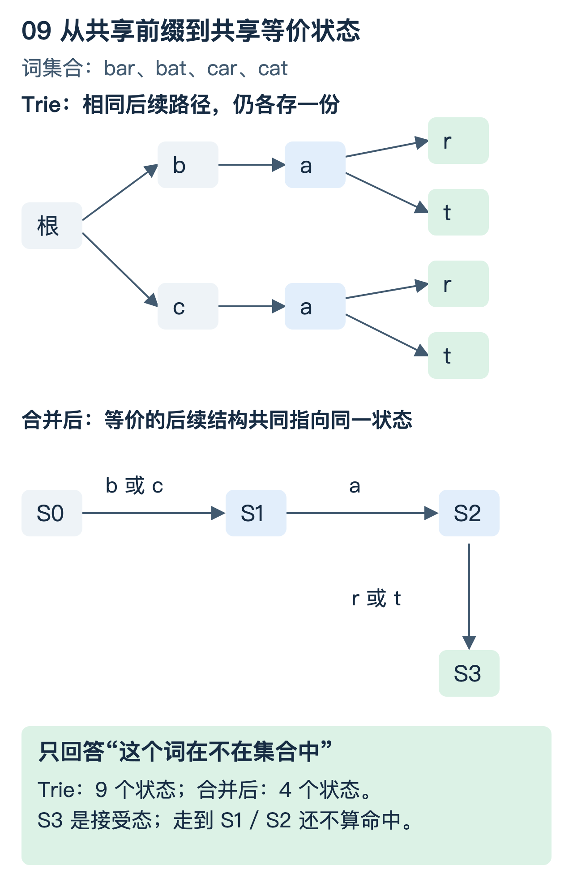
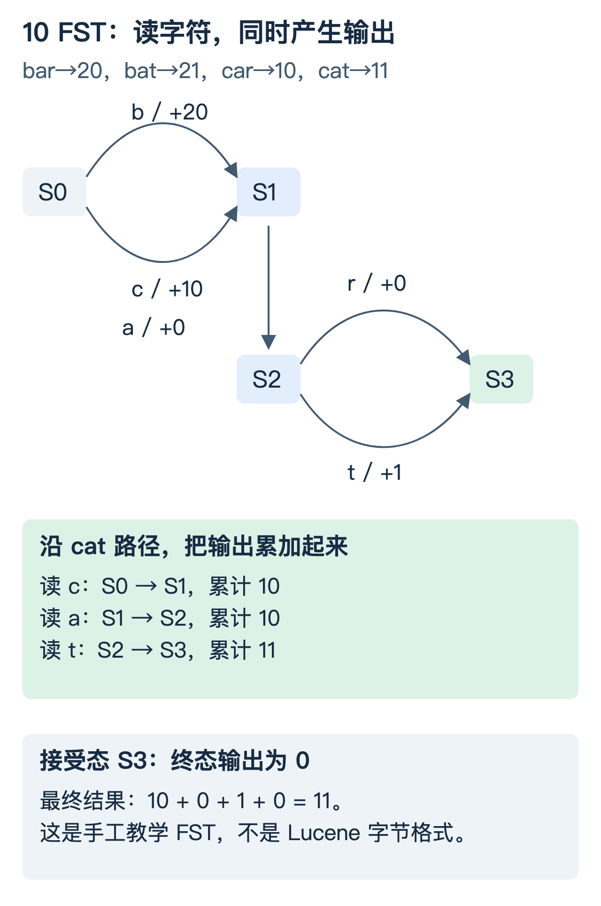
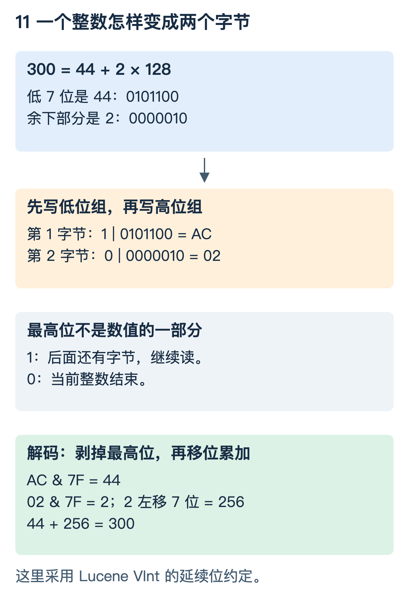
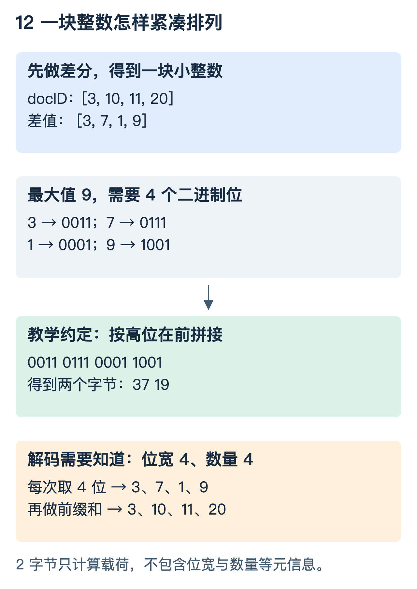
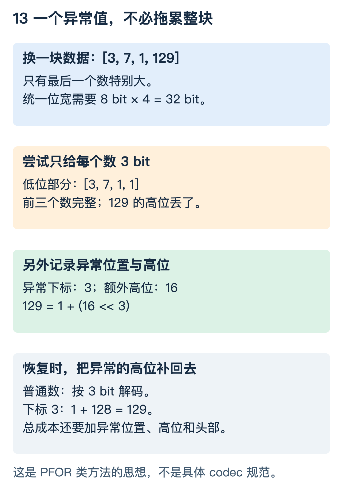

# 索引结构进阶：FST、词典压缩与倒排整数编码

上一篇[正排与倒排图解](索引结构图解_正排与倒排.md)解释了“词典定位倒排，倒排给出文档编号”。但那还只是逻辑结构：词典里有几百万个词怎么办？文档编号有几千万个，怎样减少读取和解码成本？

这篇继续向下拆。先看词怎样共享结构并输出一个值，再把四个整数实际编码成字节，最后把它们放回搜索路径。

## 1. 先分清：压缩的是哪一部分

| 对象 | 重复或规律在哪里 | 常见处理思路 |
|---|---|---|
| 词项与词典索引 | 词之间共享前缀，部分后续结构等价 | 前缀编码、trie、FSA / FST |
| 倒排 docID | 有序，邻近编号的差值往往较小 | 差分 + VInt / 位打包 |
| 词频与位置 | 多数词频较小；同一文档内位置可按差值保存 | 特化编码、整数块压缩 |
| 文档集合 | 稀疏、稠密或连续区间分布不同 | ID 数组、位图、Roaring |
| 原始字段字节 | 字节串或子串重复 | 按块使用通用压缩算法 |

**FST 不是给 docID 做整数压缩的算法；VInt 也不是一种词典树。** 它们服务于不同部分，可以在同一个索引中共同使用。

以下 FST 面向静态词典常用的无环结构；整数编码示例均为无损。向量 PQ 等允许近似误差的压缩，不属于同一类问题。

## 2. 从 Trie 到 FSA：不只共享开头，还能合并等价的未来

### 2.1 用四个词，不先背术语

假设需要判断下面这些词是否存在：

```text
bar、bat、car、cat
```

上一篇的 trie 会共享开头。例如 `bar` 和 `bat` 共享 `b → a`；`car` 和 `cat` 共享 `c → a`。

但走完 `b` 后，允许的剩余字符是 `ar` 或 `at`；走完 `c` 后，允许的剩余字符还是 `ar` 或 `at`。两边接下来能发生的事情完全相同。



看图的上半部，两份 `a → r / t` 各自保存；下半部让它们指向同一套状态。

对这个例子：

- 原 trie 包含根节点在内，共 9 个状态。
- 合并后的接受器共 4 个状态。
- 读 `cat` 可以走到接受态；读 `ca` 还没有到接受态，不能算命中。
- 读 `cab` 时没有 `b` 分支，失败。

**预测：合并后，`bat` 会不会被误判为 `cat`？**

不会。查词时仍逐个消费输入字符。共享的是“走到这里之后还允许怎样继续”，不是把输入字符串改成另一个字符串。

### 2.2 现在再定义 FSA

FSA 是有限状态接受器。这里用的是确定性的无环接受器：给它一个字符串，沿转移走完后，根据是否处于接受态回答“是 / 否”。

“共享后缀”是方便理解的简称，严格条件是：两个状态的**终止状态及后续可接受行为等价**，才能合并。不是看见两个节点字母相同就合并。

图中的字母是被消费的输入；状态本身也可以叫 S0、S1 等，不必对应一个固定字符。一个状态可以有多个入边，所以合并后的结构不再是一棵普通树。

## 3. FST：除了判断存在，还能返回一个值

### 3.1 现在需求变了：词要对应一个编号

需要保存如下映射：

```text
bar → 20
bat → 21
car → 10
cat → 11
```

这些值是人为选择的例子，可以先理解为某个块或条目的编号，不是实际 Lucene 文件地址。

如果只用刚才的 FSA，所有词最后都到同一个接受态，它只能告诉我们“存在”，不能区分返回 20、21、10 还是 11。

解决办法是：**走边时，除了消费字符，还取得一段输出；走完整条路径后，把输出组合起来。**



图中 `c / +10` 表示“读入字符 c，同时输出数值 10”。本例输出组合规则是整数加法，接受态的最终输出为 0。

| 输入 cat 的步骤 | 当前状态变化 | 此次输出 | 累计值 |
|---|---|---:|---:|
| 读 c | S0 → S1 | 10 | 10 |
| 读 a | S1 → S2 | 0 | 10 |
| 读 t | S2 → S3 | 1 | 11 |
| 输入结束，检查接受态 | S3 接受 | 0 | 11 |

现在预测 `bat`：先取 20，再取 0，最后取 1，输出 21。

但是 `ba` 即使已累计了 20，也**不能返回成功**：输入结束时还没到接受态。部分输出不是一个完整命中。

### 3.2 为什么带不同输出的词仍能共享状态

把差异先放在入口：读 b 输出 20，读 c 输出 10。后续对两条路径都是：

```text
读 a 输出 0；随后读 r 输出 0，或读 t 输出 1。
```

入口处理完差异后，剩余映射相同，便可以共享后面的状态。

如果后续输出关系不同，就不能仅凭“还能读相同字母”合并。在真实构建过程中，输出的提取、规范化和状态等价判断都是关键；这张图是手工构造的有效示例，不声称复现某个构建器的规范化结果。

### 3.3 三者区别到这里才完整

| 结构 | 本篇中的理解方式 | 是否产生关联值 |
|---|---|---|
| Trie | 用路径共享公共前缀 | 可以在节点附值，但没有自动合并等价后续结构 |
| FSA | 用状态与转移识别字符串，等价状态可合并 | 主要回答是否接受 |
| FST | 在状态转移中携带输出，完整输入得到关联值 | 是，输出按约定组合 |

FST 是 finite-state transducer，有限状态转换器。输出不一定是整数，也不一定总用加法；可以是字节序列等类型，组合规则随输出类型而定。Lucene 的 FST API 明确区分弧上的输出和接受结束时的输出。[参考：Lucene FST API](https://lucene.apache.org/core/10_3_1/core/org/apache/lucene/util/fst/FST.html)

### 3.4 “FST 小、查得快”到底有条件吗

有。共享结构和紧凑编码可以减少空间与读取量，但收益依赖词集和输出关系。9 个状态变成 4 个，不等于文件大小一定精确下降到 4/9；每条边、输出和状态还要编码。

查询沿字符串逐步走，不代表每一步都是免费 O(1)：弧怎样查找、数据在缓存还是需要读取，都会影响代价。静态词典适合紧凑组织，但更新通常需要重新构建相关结构，不能把它当作一个随时任意插删的 HashMap。

## 4. FST 在 Lucene 中究竟指向哪里

### 4.1 常见说法少了一层

“FST 把词映射到倒排表地址”可以用来建立第一印象，但描述具体 BlockTree 时通常过于简化：词典索引先帮助定位词典块，再从完整词条的元信息找到倒排数据。

```text
查询词
  ↓
词典索引：根据前缀定位词典块
  ↓
词典块：找到完整词项、统计信息、倒排元信息
  ↓
倒排数据：docID、词频、位置等
```

Lucene 9.12.0 的 Lucene90 BlockTree 文档描述：每个字段有对应的 FST，映射词前缀到磁盘词典块；输出还可能编码子块定位信息，而不只是一个简单整数。[参考：Lucene90 BlockTree](https://lucene.apache.org/core/9_12_0/core/org/apache/lucene/codecs/lucene90/blocktree/Lucene90BlockTreeTermsWriter.html)

### 4.2 为什么上一篇讲 Trie，却没有讲 FST

那一篇选用了 Lucene 10.3.1 的 Lucene103 BlockTree 文档作为例子，该格式的词典索引描述的是 trie；**这不能成为略过 FST 的理由，也不表示 FST 不重要。** 两种版本化实现都应该理解，不能用其中一个替代整个概念体系。

| 所引版本与格式 | 官方描述的词典索引 |
|---|---|
| Lucene 9.12.0 / Lucene90 BlockTree | 每字段 FST，定位词典块 |
| Lucene 10.3.1 / Lucene103 BlockTree | 每字段 trie，定位词典块 |

这是对两份明确格式文档的比较，不表示整个 Lucene 10 已经没有 FST，也不表示任何名为 Elasticsearch 的部署都采用同一种格式。[参考：Lucene103 BlockTree](https://lucene.apache.org/core/10_3_1/core/org/apache/lucene/codecs/lucene103/blocktree/Lucene103BlockTreeTermsWriter.html)

### 4.3 词典块本身也可以共享前缀

例如 `cat、cater、cattle` 可以写成一个公共前缀 `cat`，再分别记录后缀 `空串、er、tle`。

这种前缀编码压缩的是词字符串。它与“自动机合并等价状态”并非同一个操作；词典索引、词典块内容与倒排记录还可以采用不同的编码方式。

## 5. docID 压缩第一步：差分不是压缩的终点

用上一篇的整数例子：

```text
原 docID： [3, 10, 11, 20]
差值：     [3,  7,  1,  9]      ← 以 0 为起点
恢复：      3 → 10 → 11 → 20    ← 逐个累加
```

减小数值后，更有机会使用短编码。但若四个差值仍用四个 32 位整数保存，还是 16 字节，没有节省。

接下来要解决的是：**3 为什么也要占 32 位？能不能只存它确实需要的那些位？**

## 6. VInt：每个整数按自身大小占用若干字节

### 6.1 一个字节拆成控制位与数据位

这里采用 Lucene VInt 的约定：一个字节低 7 位存数值，最高位表示后面是否还有字节；低位组先写。

```text
1 | xxxxxxx   → 还要继续读
0 | xxxxxxx   → 这个整数结束
```

这是一种具体约定，不要把其他教材中“最高位 1 表示结束”的编码习惯直接混用。[参考：Lucene DataOutput.writeVInt](https://lucene.apache.org/core/10_3_1/core/org/apache/lucene/store/DataOutput.html#writeVInt(int))

### 6.2 把 300 编出来，再解回去



`300 = 44 + 2×128`。低 7 位放 44，剩下的 2 放到下一组。

| 字节 | 控制位 | 7 位数值 | 完整二进制 | 十六进制 |
|---|---:|---|---|---|
| 第一个 | 1：后面还有 | 0101100，即 44 | 10101100 | AC |
| 第二个 | 0：结束 | 0000010，即 2 | 00000010 | 02 |

解码时不能把 AC、02 当作两个原始整数。先去掉控制位，再按组恢复：`44 + (2 << 7) = 300`。

### 6.3 什么范围需要几个字节

对这里讨论的非负整数：

- 0—127：1 字节。
- 128—16383：2 字节。
- 更大的整数继续增加组数。

`[3,7,1,9]` 用这套方式，每个数 1 字节，载荷从固定 32 位存储的 16 字节变为 4 字节。这个例子中原始 `[3,10,11,20]` 也都小于 128，因此直接用 VInt 同样是 4 字节：**差分在这组小数据上没有再减少字节数。**

对更大的编号、较小的间隔，差分才可能让很多数跨过编码长度边界。不要为了演示压缩，把没有发生的收益算进去。

### 6.4 它付出了什么代价

每个整数长度不固定，读取需要识别边界。若没有额外偏移表或跳跃结构，想取第 N 个整数往往不能直接算出其字节位置。

极大的整数也未必更省，例如某些 32 位非负值要 5 个 VInt 字节，比固定 4 字节还多。小整数分布、实现和访问方式共同决定是否划算。

## 7. Bit Packing：同一块里的整数统一用 b 位

另一种办法是不让每个整数带自己的延续标记，而是先观察一块整数，确定统一位宽。



对于 `[3,7,1,9]`，最大值 9，需要 4 位。每个数都存 4 位：

```text
3       7       1       9
0011    0111    0001    1001

按本例高位在前的约定拼起来：
00110111 00011001 → 0x37 0x19
```

四个数的载荷是 16 bit，即 2 字节。读取时按每 4 位切开，再对差值做前缀和，恢复原 docID。

位宽 `b` 对一般非负块可以选为最大值的二进制位数；全零块可以单独处理。块数、位宽、基准编号、文件位置等元信息也要保存，因此**整个文件并不是只有这 2 字节**。

这个按高位拼接的例子用于手算，不是 Lucene 实际位交错、字节序或 SIMD 布局的声明。

### 与 VInt 的区别

| 方法 | 谁决定单个数占多少空间 | 主要代价 |
|---|---|---|
| VInt | 这个数本身的大小，每组增加 1 字节 | 逐数识别长度，跳到中间需额外支持 |
| 固定位宽块 | 这一块选定的位宽 b | 小值可能被块内大值拖累，需要块元信息 |

块式布局也给批量解码提供了条件，但“用了 bit packing”不自动说明已经用 SIMD。

## 8. FOR、PFOR 与异常值：别让一个大数拖累整块

### 8.1 FOR 与差分不是一个公式

FOR（Frame of Reference）先选一个块基准，再保存每个值相对这个基准的偏移：

```text
原值：[1000, 1002, 1003, 1007]
基准：1000
偏移：[   0,    2,    3,    7]
```

每个偏移可用 3 位表示，恢复时逐个加 1000。

区别是：差分减去前一个值，恢复需要前缀和；FOR 减去同一个块基准，恢复加同一个值。它们都让整数变小，但访问和恢复方式不同。

### 8.2 异常值问题

改用 `[3,7,1,129]` 这一块。129 需要 8 位，如果整块统一用 8 位，其他三个数也得跟着占 8 位。

PFOR 类方法的直觉是：多数值用较小位宽，少数装不下的值单独记录补充信息。



本例选择 3 位作为基础：

```text
低部：[3,7,1,1]
异常下标：3
异常高部：16

下标 3 的原数 = 1 + (16 << 3) = 129
```

这是“打补丁”的思想示例。不同 PFOR / FastPFOR 变体在基准、异常位置和异常值保存方式上不同，不能把这里当作其统一二进制规范。[参考：FastPFOR 项目与整数编码实现](https://github.com/fast-pack/FastPFOR)

### 8.3 四个数的玩具例子一定更省吗

不一定。基础载荷缩小了，但还要加位宽、异常下标、高部和头信息；块很小时，额外成本可能超过节省量。

选择位宽时，需要比较**普通部分 + 异常部分 + 元信息**的总成本，还要考虑解码速度，而不是只让普通部分尽量短。

## 9. SIMD 是加速手段，不是一个独立的压缩率保证

可以把 SIMD 理解为一条机器指令并行处理多份数据。整数编码若采用适合批量提取和移位的布局，就更容易利用这类指令加速解码。

它与算法的关系是：

```text
差分 / FOR：怎样把数变小
位打包 / 异常编码：怎样把数放进更少的位
SIMD：怎样更快地批量编码或解码
```

如果保存的是差值，解码出差值还不算结束，还要恢复前缀和，并将结果交给游标。端到端性能包括读取、解码、累加和求交，不能只拿解码微基准代替查询延迟。

另外，“FastPFOR 很快”不等于“Lucene 任意版本都使用 FastPFOR”。实现选择必须回到具体 codec、版本与字段配置验证。

## 10. 压缩后怎样还能跳着读

### 10.1 不要把一个词的整条倒排压成不可分割的大包

如果读取中间一小段也要从头解压整条长列表，随机访问和求交会很昂贵。因此通常要结合分块与跳跃元信息。

例如每块记录最大 docID、数据位置以及必要的解码上下文。`advance(20)` 可以先跳过最大值小于 20 的块，再定位可能包含目标的块。

如果块里保存差值，定位到块之后还得知道本块的起始基准或前序累计信息，否则拿到差值也无法还原编号。**只存一个块偏移，并不自动足够独立解码。**

### 10.2 与一个明确的真实格式对应

Lucene 10.3.1 的 Lucene103PostingsFormat 文档描述了 packed blocks 与 VInt blocks：固定 packed 块采用 128 个整数，较长列表尽量按块处理，不足部分按格式规则处理。该格式还配有 skip 数据，用来帮助迭代器跳跃。[参考：Lucene103PostingsFormat](https://lucene.apache.org/core/10_3_1/core/org/apache/lucene/codecs/lucene103/Lucene103PostingsFormat.html)

理解重点不是死记 128，而是：

- 块太大：读取和批处理友好，但位宽可能更容易被大值影响。
- 块太小：局部数值范围可能更接近，但头部和跳跃元信息占比增加。
- 要一起优化存储、读取、解码和跳跃，不能只比较压缩后字节数。

词频、词位置也可以有自己的编码特例和块边界；不能因为逻辑上是一条 posting，就推断所有字段永远紧挨着、一起解码。

## 11. Roaring、LZ4 这些名字又放在哪里

### 11.1 Roaring 压缩的是整数集合

普通 BitSet 为整个编号范围保留位，稀疏时未必划算。32 位 Roaring 把整数按高 16 位分组，在组内保存低 16 位，并按数据形态使用数组、位图或连续区间等容器。

例如 `65538 = (1 << 16) + 2`：高位分组是 1，组内数值是 2。若一组只有几个值，用紧凑数组；若非常稠密，位图更合适；很多连续区间则可能受益于 run 容器。实际容器选择还取决于大小与运算成本。[参考：Roaring 格式规范](https://github.com/RoaringBitmap/RoaringFormatSpec)

它保存集合成员，不直接保存每个词的词频和位置。因此可以参与过滤或集合运算，但不是“一套 Roaring 就替代了所有倒排结构”。

### 11.2 LZ4 等通用压缩处理字节串

LZ4 的块格式利用原样字节和对前面重复片段的引用组织数据，适合讨论通用字节块的压缩，而不是直接替代词典或查询算法。[参考：LZ4 block format](https://github.com/lz4/lz4/blob/dev/doc/lz4_Block_format.md)

正文、存储字段等字节块可以有自己的压缩选择；具体引擎是否采用 LZ4、Zstd 或其他方案，以及怎样切块，都要看格式与配置。

为什么不对所有内容统一 gzip 一遍？因为空间之外，还要求快速定位、部分读取和低延迟解码。即便使用通用压缩，也需要合适的块边界和目录，而不是只生成一个巨大压缩包。

## 12. 把 FST 与整数解码放回同一条链路

以采用 FST 词典索引的实现为例：

```text
查询词
  → 沿 FST 消费字符并组合输出
  → 根据输出定位词典块
  → 找到完整词项及其倒排元信息
  → 借助 skip 信息定位目标倒排块
  → 解码 VInt 或 packed 数据
  → 将差值还原为 docID
  → 游标求交 / 打分 / 过滤
  → 按文档编号读取返回字段
```

现在，“查词典”“读取倒排”不再是两个黑盒：前者有字符串路径与块定位，后者有具体字节编码与可跳跃的块结构。

### 本篇最容易混的六件事

1. FST 不只是 trie 换个名字：它表达带输出的映射，合并要考虑剩余输出行为。
2. 差分不自动压缩：还需紧凑编码。
3. VInt 与 bit packing 不是同一种边界设计。
4. PFOR 的异常数据也占空间，不能忽略后再宣布节省倍数。
5. SIMD 关注批处理执行，不代表无条件更高压缩率。
6. 词典编码、倒排整数压缩、集合压缩、原文压缩服务不同对象。

## 13. 运行同样的数据，核对每一个字节

```bash
python3 examples/fst_compression_demo.py
```

程序包括手工 FST 路径查询、VInt 编解码、差分还原、位打包与异常值补回。它不构建最小 FST、不实现 FastPFOR，也不输出 Lucene 兼容文件。

对应关系：

| 图中的动作 | 代码函数 |
|---|---|
| 读字符并累计输出，最后验证接受态 | `fst_lookup()` |
| 每次写低 7 位，并标记后面是否还有 | `encode_vint()` |
| 去掉延续位，按 7 位步长恢复数值 | `decode_vint()` |
| 固定位宽拼接 / 拆分载荷 | `pack_bits()` / `unpack_bits()` |
| 低部加上异常高部 | `patch_restore()` |

应能看到：

```text
FST: bar=20, bat=21, car=10, cat=11
VInt 300: ac 02 -> 300
Packed [3, 7, 1, 9]: 37 19 -> [3, 7, 1, 9]
Recovered docIDs: [3, 10, 11, 20]
Patched: [3, 7, 1, 129]
```

最后尝试预测三个变化：`cat` 走到 `ca` 就停会怎样？VInt 的整数从 127 变成 128，会多几个字节？一块数据多出 129 后，统一位宽为什么变大？能从路径和位分组推导这些结果，比记住算法名称更重要。
